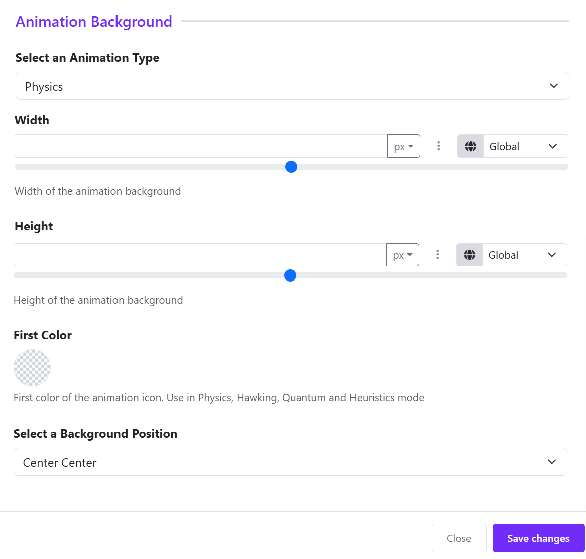

Astroid 3.4.0 introduced a **completely upgraded animation engine** not just simple fade/slide effects, but a **multi-layer system**:

* ✅ Basic animations
* ✅ Transform Scenes 
* ✅ Animated backgrounds (**Available for Astroid Pro only**)

This makes it possible to build **interactive, scroll-based or mouse-based animations** similar to modern UI frameworks. ([forum.joomla.de][1])

---

# 1. Animation (Basic) – Quick Effects

Adds **simple entrance animations** to sections, columns, and elements.


### How to use

* Go to: Element / Column / Section → **Animation tab**
* Choose from dropdown:

  * None
  * Bounce
  * Flash
  * Pulse
  * Shake
  * Swing
  * Tada
  * ...

### Best practice

* You can use **only 1–2 animation styles per page**, and avoid overuse that hurts UX.

# 2. Transform (Advanced)

## Concept: “Scenes”

A **Transform Scene = a step-based animation timeline**
Transform Scenes are a powerful way to create complex, multi-step animations that are triggered by scroll or mouse movement. Each scene can have its own unique animation properties, allowing you to create dynamic and engaging animations that respond to user interactions. With Transform Scenes, you can easily create animations that are triggered by scroll or mouse movement, making it easy to add interactivity and engagement to your website.

You can:

* Animate on scroll
* Animate on mouse movement
* Combine multiple effects

## Structure

```
Transform Scenes
   └── Scene 1
         ├── Trigger (scroll / mouse)
         ├── Start state
         ├── End state
         └── Properties (Move, Opacity, Rotate, Scale, Skew)
```

## How to create

### Step 1: Click **Add Item** to create a scene

Click on **Add Item** button to create a new animation scene.


### Step 2: Configure animation behavior


Typical properties include:

* Move (X, Y movement): Move allows you to animate the position of an element along the X and Y axes. You can specify the start and end points of the animation.
* Opacity: Opacity allows you to animate the transparency of an element. You can specify the start and end opacity values, where 0 is fully transparent and 1 is fully opaque.
* Rotate: Rotate allows you to animate the rotation of an element around a specified axis. You can specify the start and end angles of the rotation.
* Scale (zoom in/out): Scale allows you to animate the size of an element. You can specify the start and end scale values for both the X and Y axes.
* Skew: Skew allows you to animate the skewing of an element along the X and Y axes. You can specify the start and end skew angles for both axes.
* Tween Settings:

## Timeline Settings


A Timeline is a powerful sequencing tool that acts as a container for tweens and other timelines, making it simple to control them as a whole and precisely manage their timing.

* **Animation Element**: Specify which HTML element receives the animation. Example: `.card`  This means all elements with class .card will animate.

Common Selector: 

| Selector     | Description                     |
| ------------ | ------------------------------- |
| `.card`      | Animate card elements           |
| `.title`     | Animate titles                  |
| `#hero`      | Animate specific element        |
| `.image img` | Animate images inside container |


* **Repeat**: You can specify the number of times the animation should repeat, or set it to -1 for infinite repetition.

| Value | Result         |
| ----- | -------------- |
| `0`   | Play once      |
| `1`   | Repeat once    |
| `5`   | Repeat 5 times |
| `-1`  | Infinite loop  |

* **Recommended Usage**
Use 0 for scroll animations
Use -1 for floating or decorative effects

## Scroll Settings

Scroll Settings allow you to control how the animation is triggered by scroll events. You can specify the trigger point, duration, and easing of the animation.

* **Start**: The point at which the animation will start as the user scrolls. This can be defined in pixels or as a percentage of the viewport height. Ex: top 80%

Common Start Values

| Value           | Effect                     |
| --------------- | -------------------------- |
| `top 100%`      | Starts late                |
| `top 85%`       | Smooth standard trigger    |
| `top 50%`       | Starts earlier             |
| `center center` | Trigger at viewport center |

* **End**: The point at which the animation will end as the user scrolls. This can be defined in pixels or as a percentage of the viewport height. Ex: top 80% +=500

Practical Examples:

| Value    | Result                |
| -------- | --------------------- |
| `+=300`  | Short animation       |
| `+=500`  | Standard duration     |
| `+=1000` | Long cinematic scroll |


* **Scrub**: 

Scrub controls animation smoothness. Ex: 1.7 Means The animation smoothly catches up to the scroll position over 1.7 seconds.

Recommended Values: 

| Value | Effect                  |
| ----- | ----------------------- |
| `0`   | Immediate response      |
| `0.5` | Slight smoothing        |
| `1.5` | Smooth cinematic effect |
| `3`   | Very slow motion        |

* **Pin**: Pin keeps an element fixed while scrolling.

* **Marker**: Markers display visual debugging indicators on the page. When enabled, Astroid shows:

Animation start point
Animation end point
Trigger locations

* **Toggle Action**: Toggle Actions control animation behavior during scrolling events.

# 3. Animation Background – Visual Effects Layer

This is separate from element animation. Adds **animated visuals behind your content**



## Key settings

### 1. Animation Type

Choose an animation type available from the drop-down list. 

* Physics
* Hawking
* Quantum
* Heuristics

### 2. Width & Height

Controls animation canvas size

👉 Tip:

* Use **full width (100%)** for sections
* Fixed height for hero areas

### 3. First Color

First color is the main color of animation elements

👉 Used in: Physics, Quantum, Hawking, and Heuristics mode

### 4. Background Position

Choose a background position:
* Left top
* Left center  
* Left bottom
* ...


