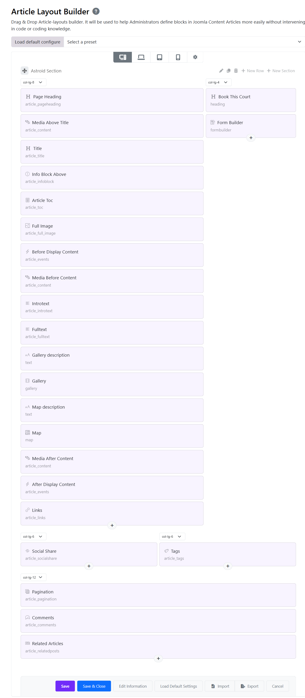
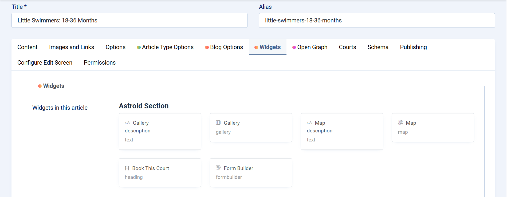
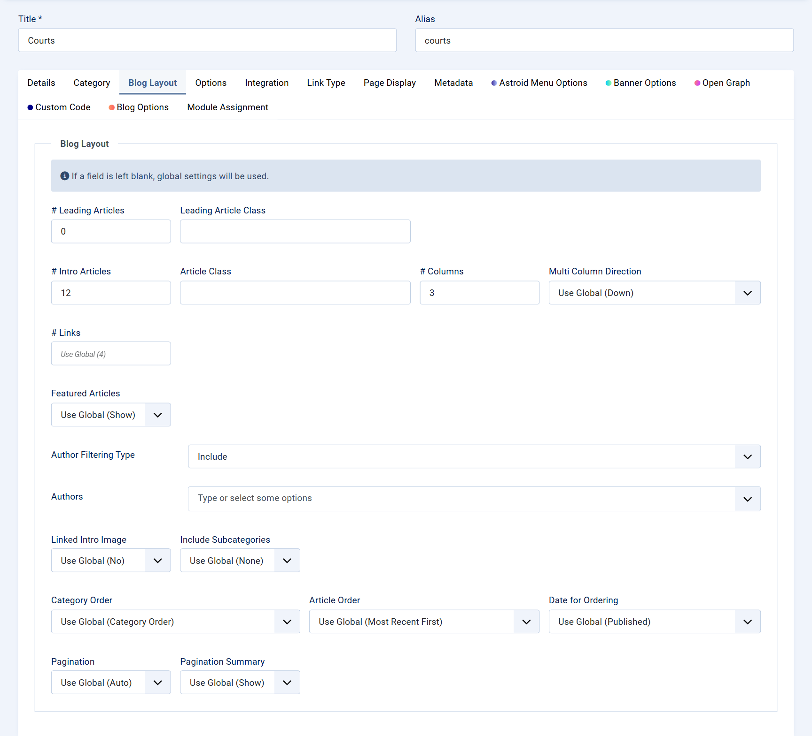
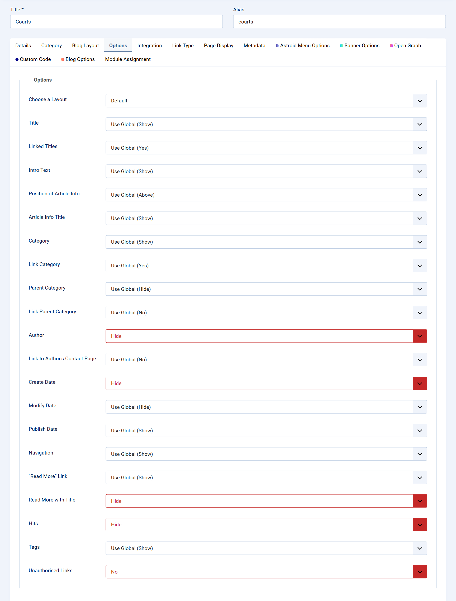

# Courts Page

The Courts page of Sbona Sports and Outdoor Joomla Template is designed to present sports facilities in a modern, energetic, and highly professional way. Inspired by real-world sports club booking systems, this page combines dynamic visuals with practical functionality, making it ideal for tennis clubs, pickleball centers, padel courts, badminton arenas, and multi-sport facilities.

## Single Court

### How to Create a Single Court Article Using Astroid Article Layout Builder

The Astroid Framework includes a powerful [Article Layout Builder](https://docs.astroidframe.work/layout-builder/article-layout-builder) that allows you to create fully customized single article pages without writing code. In the Sbona Sports and Outdoor Joomla Template, this feature is used to build professional court detail pages with galleries, maps, booking forms, and custom content sections. ([docs.astroidframe.work][1])

This guide will show you how to create a complete **Single Court Article** using the Astroid Article Layout Builder.

#### What You Will Build

A typical court detail page in Sbona may include:

* Court title and featured image
* Court gallery
* Description text
* Location map
* Court information
* Booking form
* Additional custom widgets

The entire layout is managed visually through Astroid’s drag-and-drop system.

#### Step 1 — Create an Article Layout

Go to:

**Administrator → Templates → Styles → astroid_sbona - Default → Template Options**

Then navigate to:

**Article/Blog → Article Layout Builder** → **New Layout**

You can either:

* Build the layout manually using **Add Section**
* Or use **Load Default Settings** as a starting point.

#### Step 2 — Add Layout Sections

Inside the Article Layout Builder:

1. Click **Add Section**
2. Add rows and columns
3. Insert widgets and article elements

Astroid layouts are structured with:

* Sections
* Rows
* Columns
* Elements/Widgets

#### Step 3 — Add Court Widgets

After creating sections, click:

**Add Element**

Then choose the widgets you want to use. Typical widgets for a Court article include:

* Text Widget
* Heading Widget
* Gallery Widget
* Map Widget
* Form Builder Widget

Astroid allows widget default values to be configured directly inside the layout builder. These values can later be overridden per article.
Here below is a prebuilt Court Article Layout:

#### Step 4 — Configure Widgets in the Article

After saving the layout, create or edit your Court article:

**Administrator → Content → Articles**, Open your article and go to the **Widgets** tab.

You will see all widgets added in the Article Layout Builder, and customize the content for each widget individually:

* Upload court gallery images
* Add Google Map location
* Edit descriptions
* Configure booking forms
* Add court-specific information

This override system allows you to reuse one layout for multiple courts while keeping each article unique.

#### Step 5 — Assign the Layout to Your Court Category

To apply the layout to all court articles, please go to: **Administrator → Content → Categories**

Edit your Court category and open: **Single Blog Options**

Then:

1. Select your Astroid template
2. Choose the created Article Layout
3. Save the category

Now every article inside this category will automatically use the Court layout.

## Court Listing Page

The Court Listing Page is the main archive page that displays multiple court articles from a selected category.

### Create the Court Listing Menu Item

Go to: **Administrator → Menus → Main Menu > Click New**

The Category Blog layout is used to automatically display all court articles from the selected category.

| Setting           | Value         |
| ----------------- | ------------- |
| Menu Item Type    | Category Blog |
| Choose a Category | Courts        |
| Title             | Courts        |

### BLog Layout Options

Joomla Administrator → Menus → Court Menu → **Blog Layout** Tab.

The Blog Layout tab allows you to control how articles are displayed in your Astroid-powered blog or listing page. This is commonly used for pages such as Courts, Teams, News, Events, or Blog archives.

### Other Options

Joomla Administrator → Menus → Court Menu → **Options** Tab.

The Options tab controls how article information and metadata are displayed on your Astroid blog or listing page. These settings help you customize the appearance of article cards, blog posts, news listings, and directory layouts.

