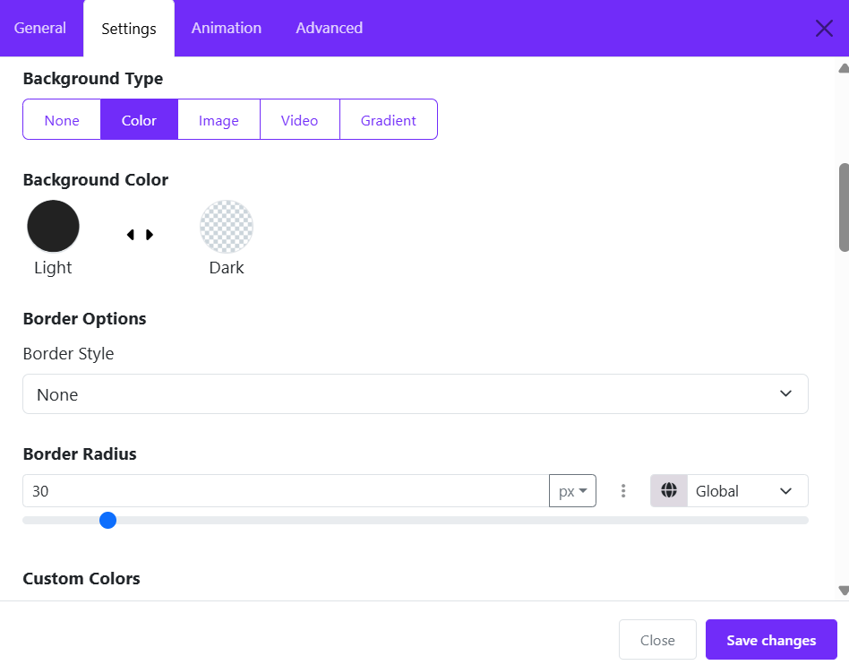
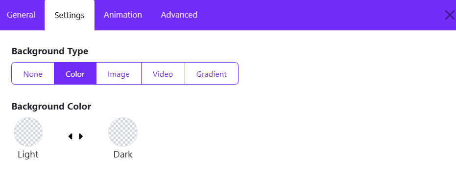
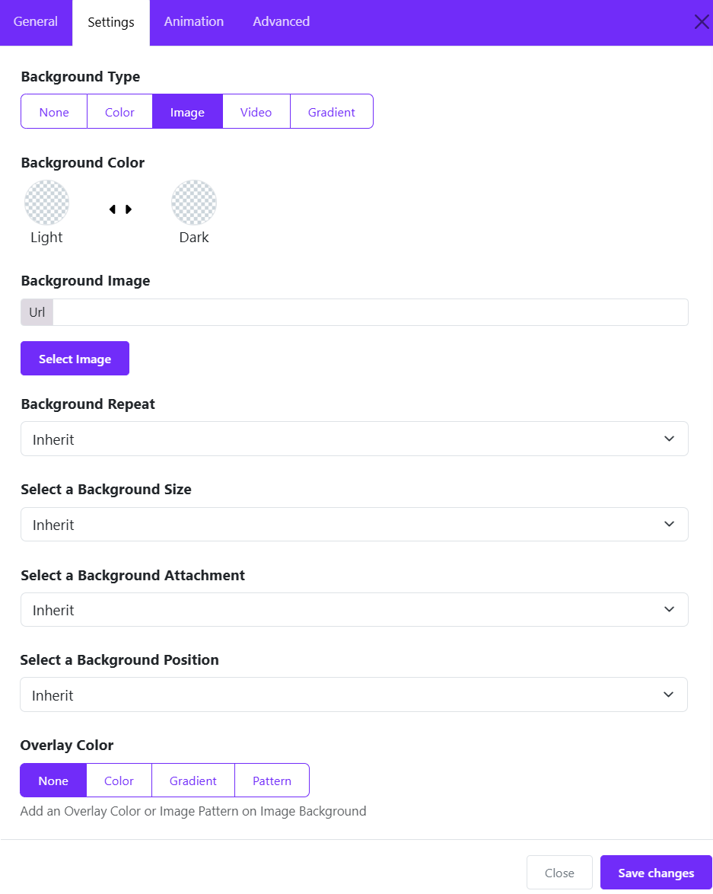
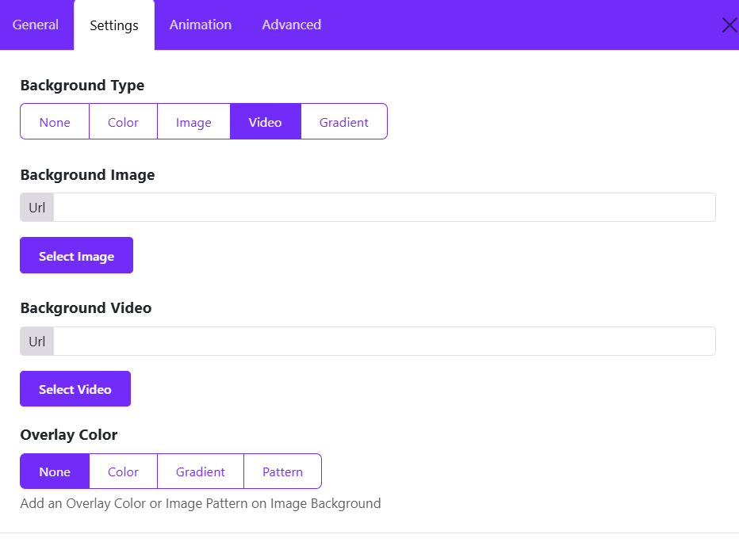
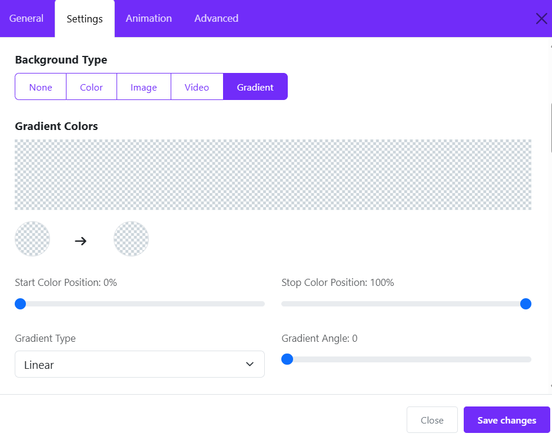

# Section Background

Layout Builder allows you to create visually engaging website sections using colors, images, videos, overlays, gradients, spacing, and animation effects. It is one of the most important design tools for building modern Joomla websites without coding.

To configure a section background:

1. Login to Joomla Administrator
2. Go to **Templates → Styles**
3. Open **astroid_sbona - Default**
4. Click the **Layout** tab
5. Click the **Edit Section** icon
6. Open the **Design Settings** tab

Inside this panel, you will find all background-related options.

## Background Types

Astroid supports several background types for sections:

* None
* Color
* Image
* Video
* Gradient

These options help create different visual styles depending on your website design.

## 1. Solid Color Background

A color background is the simplest and fastest way to style a section. Suitable for: 

* Headers
* Footer sections
* Highlighted call-to-action areas
* Minimal clean designs

### How to Use

1. Edit the section
2. Go to **Design Settings**
3. Set **Background Type → Color**
4. Choose your desired color

## 2. Image Background

Image backgrounds are commonly used for hero sections, banners, and promotional areas.

### How to Add an Image Background

1. Set **Background Type → Image**
2. Upload or select an image from Joomla Media Manager
3. Configure the image settings

Available settings include:

* Background Repeat
* Background Size
* Background Position
* Background Attachment
* Overlay Color

### Image Background Options

#### Background Repeat

Controls how the image repeats.

Options include:

* No Repeat
* Repeat
* Repeat X
* Repeat Y

#### Background Size

Controls how the image fills the section.

* Cover: The image fills the entire section while maintaining proportions. Suitable for Hero banners and Full-screen sections
* Contain: The full image remains visible inside the section. Suitable for Logos and Pattern illustrations
* Inherit: Uses inherited sizing behavior.

#### Background Position

Defines where the image starts. Here below are common positions:

* Center Center
* Left Top
* Right Bottom
* Center Top

#### Background Attachment

Controls scrolling behavior.

* **Scroll**: Image moves normally with the page.
* **Fixed**: Creates a parallax-like effect.

## 3. Video Background

Astroid supports video backgrounds for dynamic sections.

### How to Add

1. Set **Background Type → Video**
2. Insert a video URL
3. Configure overlay if needed

### Performance Tips

* Use optimized MP4 videos
* Keep video duration short
* Avoid very large files
* Always use overlay for readability
* Do not overuse video backgrounds because they may affect loading speed on mobile devices.

## 4. Gradient Background

Gradient backgrounds create modern and elegant visual effects. Best for Modern UI sections, Buttons and highlights, Landing pages, Tech websites

### Usage

1. Select **Background Type → Gradient**
2. Choose colors
3. Configure gradient direction

## Overlay Color

Overlay adds a semi-transparent layer above the background image or video.

### Why Use Overlays?

Overlays improve:

* Text readability
* Visual consistency
* Contrast
* Professional appearance

## Custom Colors

Astroid allows custom section text colors. Custom colors ensure text remains readable regardless of the background type.

Available Options:

* Text Color
* Link Color
* Link Hover Color

