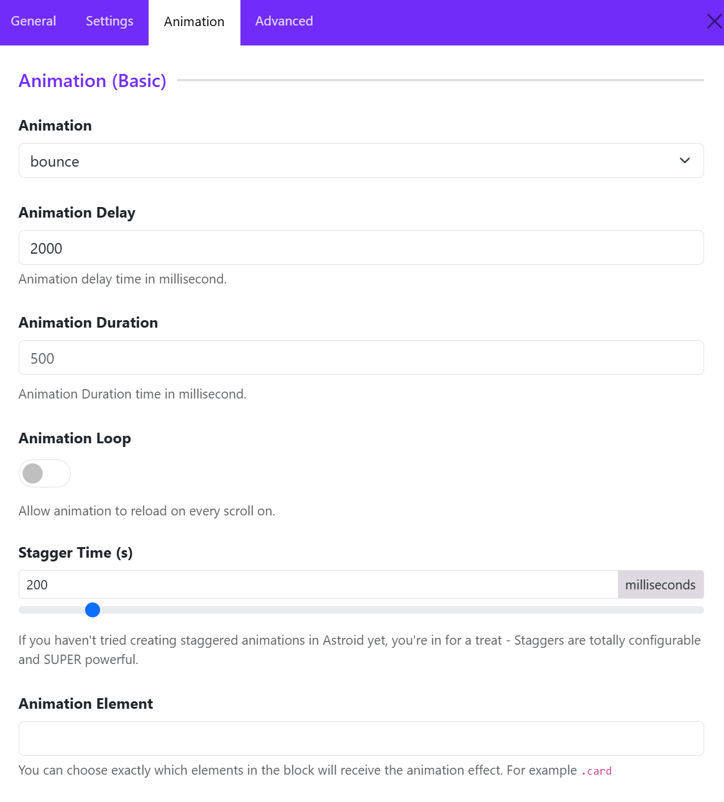
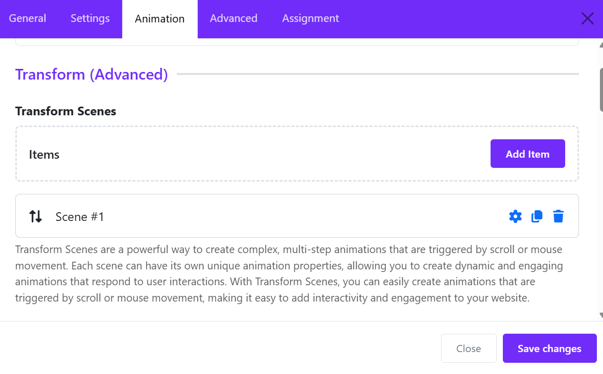
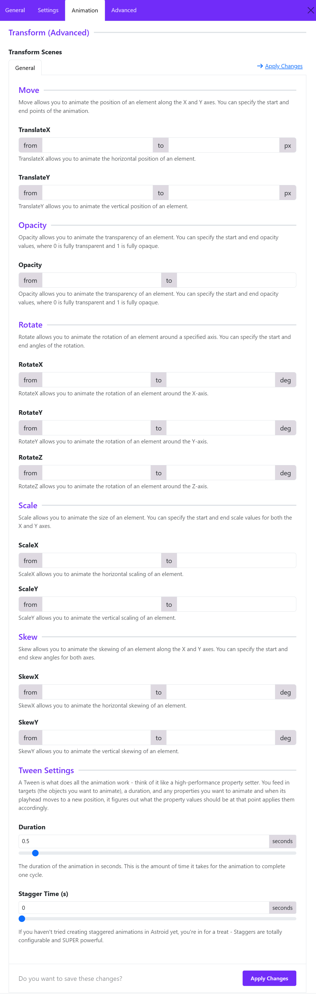

Astroid 3.4.0 introduced a **completely upgraded animation engine** not just simple fade/slide effects, but a **multi-layer system**:

* ✅ Basic animations
* ✅ Transform Scenes 
* ✅ Animated backgrounds (**Available for Astroid Pro only**)

This makes it possible to build **interactive, scroll-based or mouse-based animations**.

---

# 1. Animation (Basic) – Quick Effects

Adds **simple entrance animations** to sections, columns, and elements.



### How to use

* Go to: Element / Column / Section → **Animation tab**
* Choose from dropdown:

  * None
  * Bounce
  * Flash
  * Pulse
  * Shake
  * Swing
  * Tada
  * ...

### Best practice

* You can use **only 1–2 animation styles per page**, and avoid overuse that hurts UX.

# 2. Transform (Advanced) – (Astroid Pro Only)

## Concept: “Scenes”

A **Transform Scene = a step-based animation timeline**
Transform Scenes are a powerful way to create complex, multi-step animations that are triggered by scroll or mouse movement. Each scene can have its own unique animation properties, allowing you to create dynamic and engaging animations that respond to user interactions. With Transform Scenes, you can easily create animations that are triggered by scroll or mouse movement, making it easy to add interactivity and engagement to your website.

You can:

* Animate on scroll
* Animate on mouse movement
* Combine multiple effects

## Structure

```
Transform Scenes
   └── Scene 1
         ├── Trigger (scroll / mouse)
         ├── Start state
         ├── End state
         └── Properties (Move, Opacity, Rotate, Scale, Skew)
```

## How to create

### Step 1: Click **Add Item** to create a scene

Click on **Add Item** button to create a new animation scene.



### Step 2: Configure animation behavior



Typical properties include:

* Move (X, Y movement): Move allows you to animate the position of an element along the X and Y axes. You can specify the start and end points of the animation.
* Opacity: Opacity allows you to animate the transparency of an element. You can specify the start and end opacity values, where 0 is fully transparent and 1 is fully opaque.
* Rotate: Rotate allows you to animate the rotation of an element around a specified axis. You can specify the start and end angles of the rotation.
* Scale (zoom in/out): Scale allows you to animate the size of an element. You can specify the start and end scale values for both the X and Y axes.
* Skew: Skew allows you to animate the skewing of an element along the X and Y axes. You can specify the start and end skew angles for both axes.
* Tween Settings: A Tween is what does all the animation work - think of it like a high-performance property setter. You feed in targets (the objects you want to animate), a duration, and any properties you want to animate and when its playhead moves to a new position, it figures out what the property values should be at that point applies them accordingly.

# 3. Animation Background – Visual Effects Layer

This is separate from element animation. Adds **animated visuals behind your content**


## Key settings

### 1. Animation Type

Choose an animation type available from the drop-down list. 

* Physics
* Hawking
* Quantum
* Heuristics

### 2. Width & Height

Controls animation canvas size

👉 Tip:

* Use **full width (100%)** for sections
* Fixed height for hero areas

### 3. First Color

First color is the main color of animation elements

👉 Used in: Physics, Quantum, Hawking, and Heuristics mode

### 4. Background Position

Choose a background position:
* Left top
* Left center  
* Left bottom
* ...


