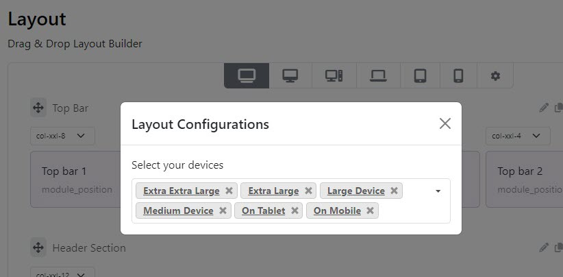

# Layout Builder

The Layout Builder is a visual and intuitive tool in the Astroid Framework that allows you to design your Joomla website’s layout using a drag-and-drop interface. It enables you to structure your template without writing any code.

## Overview

Astroid Framework’s Layout Builder gives you full control over your Joomla template’s structure using a visual drag-and-drop interface. The layout is organized as a nested tree:

``` 
root  
└── sections  
    └── rows  
        └── cols  
            └── elements (components, modules, widgets, etc.)
```


## Layout Hierarchy Breakdown

* **Root**: The top-level container for your layout.
  * The top-level container that holds all sections.
  * Usually corresponds to the entire template layout.
  * Not editable directly but serves as the parent container.
* **Sections**: A section is a major block of layout, commonly used to separate different parts of the page like Header, Main Content, Footer, etc.
  * Parent: root
  * Children: rows
  * Configurable Properties:
    * Name (label)
    * Background (color/image/video)
    * Width (container/container-fluid/full-width)
    * Padding & margin
    * Custom classes and IDs
* **Rows**: Rows are horizontal containers within sections that can hold multiple columns.
  * Parent: section
  * Children: cols
  * Configurable Properties:
    * Name (label)
    * Background (color/image/video)
    * Padding & margin
    * Custom classes and IDs
* **Columns**: Columns are vertical containers within rows that hold elements like text, images, modules, etc.
  * Parent: row
  * Children: elements
  * Configurable Properties:
    * Name (label)
    * Width (Bootstrap grid classes). Each column’s width is defined using the 12-grid system (e.g., 6+6, 4+4+4)
    * Background (color/image/video)
    * Padding & margin
    * Custom classes and IDs
* **Elements**: Elements are the actual content blocks within columns, such as text, images, modules, etc.
  * Parent: col
  * Children: none (elements are leaf nodes)
  * Configurable Properties:
    * Type (component, module position, text, image, etc.)
    * Content (text, image source, module selection)
    * Alignment (left, center, right)
    * Padding & margin
    * Custom classes and IDs

## Working with Layout Builder

1. **Accessing the Layout Builder**:
   1. Log in to your Joomla Administrator Panel.
   2. Navigate to Templates > Styles.
   3. Select the template that uses Astroid Framework.
   4. Click on the Layout tab.
2. **Add Section**
    1.	Click “Add Section”
    2.	Enter a name (e.g., “Header”)
    3.	Configure width and background

3. **Add Row**
   1.	Inside a section, click “Add Row”
   2.	Choose column layout (1-column, 2-column, etc.)

4. **Add Columns**
   1.	Columns are added by default when you add a row
   2.	You can split columns, resize, duplicate, or delete them

5. **Add Elements**
   1.	Click inside a column
   2.	Choose from: Component, Module Position, or Widget
   3.	Configure the element’s name or settings

## Responsive Configuration

The Layout Builder allows you to configure how your layout behaves on different screen sizes:

* **XXL** \(Larger Desktop\): Default layout for larger screens.
* **XL** \(Desktop\): Adjusts layout for standard desktop screens.
* **LG** \(Tablet\): Optimizes layout for tablet devices.
* **MD** \(Mobile Landscape\): Configures layout for mobile landscape orientation.
* **SM** \(Mobile Portrait\): Adjusts layout for mobile portrait orientation.
* **XS** \(Extra Small\): Configures layout for very small screens (e.g., small phones).




## Saving and Applying Layouts

* Use the Save or Save & Close buttons to apply changes
* Use Export and Import to back up or reuse layout configurations (JSON format)

## Best Practices

* Only use one Component element per layout
* Use descriptive names for module positions
* Place Widgets in reusable areas like header, top bar, or footer
* Always preview on mobile before going live
* Backup before major changes via Export

## FAQs

:::info[Q: Can I assign different layouts to different menu items?]

A: Yes, using Astroid’s Menu Assignment feature.

:::

:::info[Q: Can I nest elements inside elements?]

A: No. Elements live inside columns. Nesting is handled via rows and columns only.

:::

:::info[Q: Can I define custom widgets?]

A: Yes, you can create custom widgets and use them in the Layout Builder.

:::