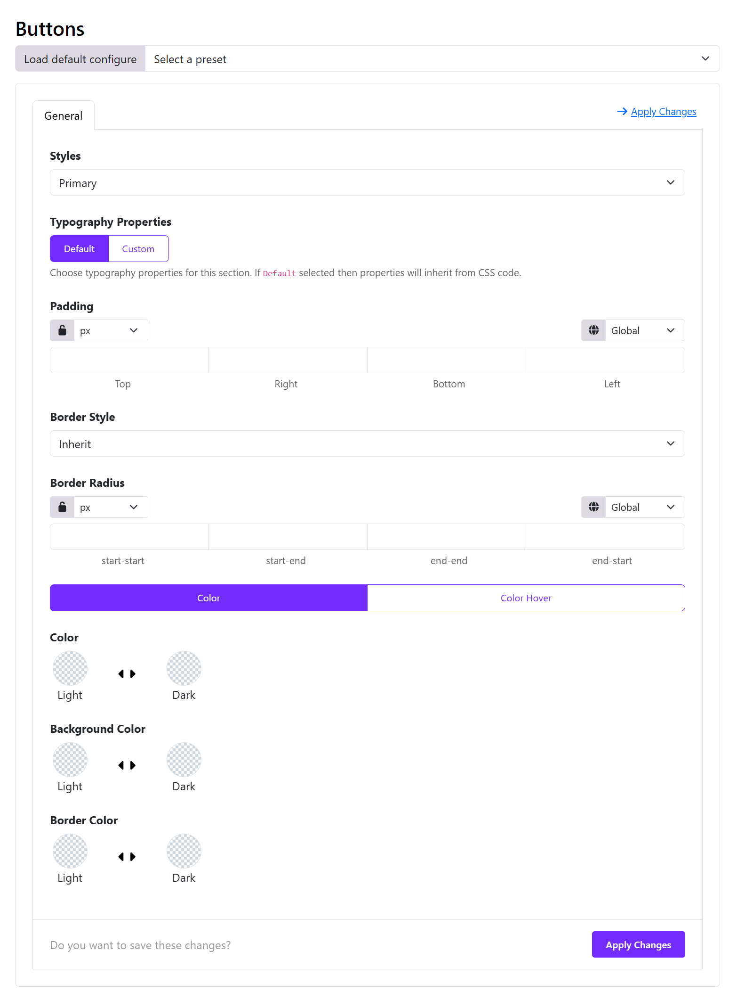
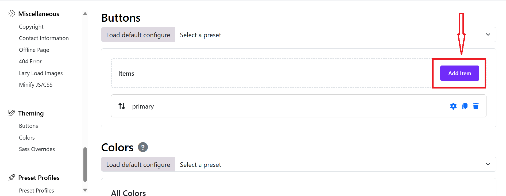
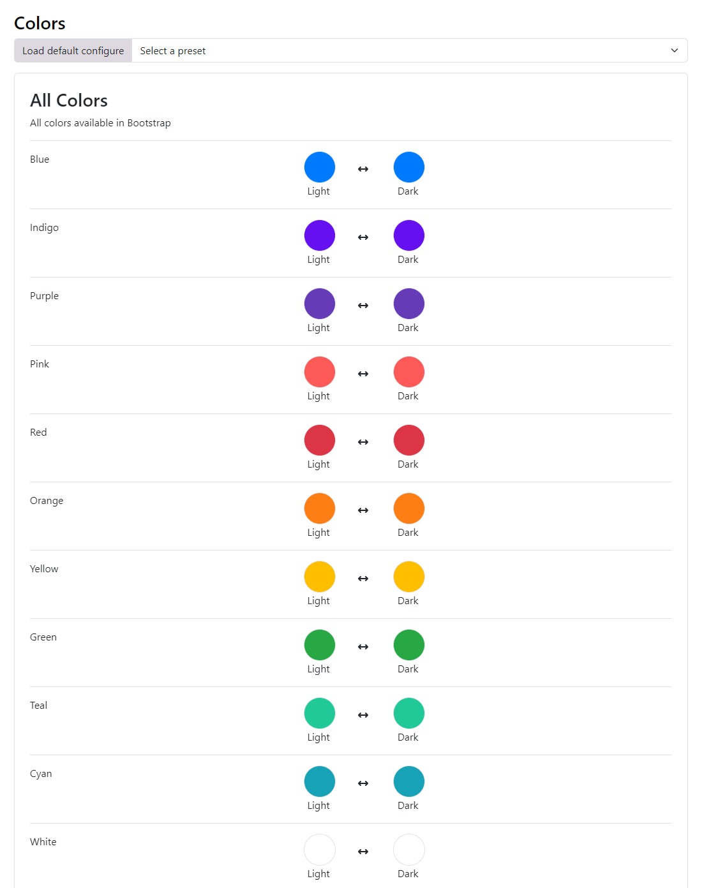
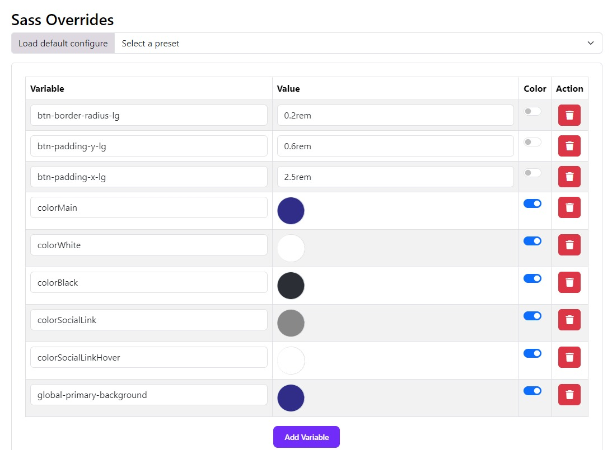

# Buttons



## 🎯 Goal

Create a **single place to define button styles** (primary, secondary, etc.), so you don’t need to style buttons individually across your site.

This works similarly to a **design system**: define once → reuse everywhere. You can find Button settings in Template Options > Theming > Buttons.

---

## 🧭 2. Step-by-step: Configure a centralized button system

### 🔹 Step 1 — Choose a Style (your “named button”)

Click on the "Add Item" button to add a new button item.



At the top: Choose a button style > Primary

👉 This means:
You are editing **ALL `.btn-primary` buttons globally**

---

### 🔹 Step 2 — Define Typography 

Switch:

```
Typography → Custom
```

Set:

* Font size (e.g. 16px)
* Font weight (e.g. 500–600)

💡 Tip:
Keep typography consistent across all button types

---

### 🔹 Step 3 — Set Padding (button size system)

Example:

```
Top: 10px
Right: 20px
Bottom: 10px
Left: 20px
```

👉 This defines:

* Button size
* Clickable area

💡 Best practice:

* Primary: larger padding
* Secondary: slightly smaller

---

### 🔹 Step 4 — Border & Shape

#### Border Style

* Choose one of available options: None, solid, dashed, dotted, double. 

#### Border Radius

* Set the border radius for Start Start, Start End, End End, and End Start.

Example:

```
6px → modern
50px → pill button
0 → sharp edges
```

---

### 🔹 Step 5 — Define Colors

You have 2 tabs:

#### ✅ Normal state

Set:

* Text Color
* Background Color
* Border Color

#### ✅ Hover state (click “Color Hover”)

Set:

* Hover background
* Hover text color
* Hover border

👉 This is critical for UX

---

### 🔹 Step 6 — Light / Dark mode support

Each color has:

* Light mode
* Dark mode

👉 If your site uses dark mode:

* Define both
* Otherwise leave dark empty

---

### 🔹 Step 7 — Click “Apply Changes”

Top-right or bottom, you can see "Apply Changes" button, click on it to save the button style configurations then click save the template style.

👉 This compiles dynamic CSS across your site. 
You can refer to this video tutorial: [Video Reference](https://www.youtube.com/watch?v=eGvkrtUZh7Y)

---

## 🧩 3. Repeat for other button styles

Now repeat the same steps for other button styles.


## 🧠 4. Build a REAL centralized system

Here’s how to structure it professionally:

| Style     | Purpose     | Example     |
| --------- | ----------- | ----------- |
| Primary   | Main CTA    | Buy, Submit |
| Secondary | Alternative | Cancel      |
| Outline   | Minimal     | Learn More  |
| Danger    | Risk        | Delete      |

👉 You are not choosing colors
👉 You are defining **meaning**

---

## 🔗 5. How to USE these centralized styles

### In Astroid / SP Page Builder

Choose:

```
Button Style → Primary
```

### In HTML

```html
<a class="btn btn-primary">Click</a>
```

👉 These will automatically use your global settings.

---

# Theming

Astroid Framework provides a powerful theming system that allows you to customize the look and feel of your Joomla template. You can easily change colors, fonts, and other visual elements to match your brand or personal style.

## 📍 Where to Start?
1. Log in to your Joomla Administrator Panel.
2. Go to: System → Site Templates → Templates (Site).
3. Click on the Astroid template you are using.
4. Click the “Template Options” button.
5. Go to the `Theming` tab.
6. Here you can change the default colors and link them with the different areas of your website.
7. Click the `Save` button to apply your changes.

Theming comes with 2 major features.

Select the default colors and link those colors with the default area of your website (i.e. primary, secondary and others).

---

## 🌈 Color Palette
Astroid Framework allows you to define a color palette for your template. This palette can be used throughout your site to maintain a consistent look and feel.



## 🎨 Custom Colors
You can also define custom colors for specific elements of your template. This allows you to create unique styles for different sections of your site.
The SASS Overrides system is the ability to override bootstrap SAAS variables. Assuming you know SAAS and want to override the default bootstrap variables. You can easily do so by modifying the variables in the backend itself.

Default Bootstrap SAAS variables can be found in the file `JOOMLAROOT/media/astroid/assets/vendor/bootstrap/scss/_variables.scss`

You can override it in your template (ex: astroid_template_two) in the file `JOOMLAROOT/media/templates/site/astroid_template_two/scss/variable_overrides.scss`

