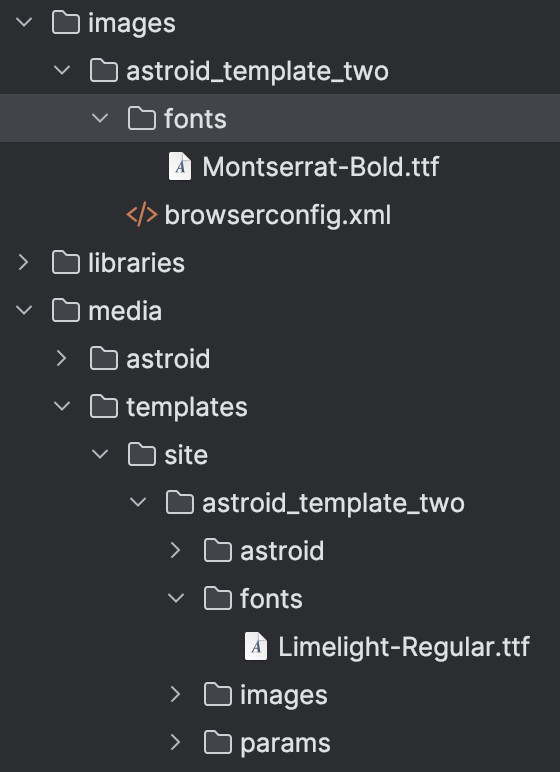

# Typography

The Typography feature in Astroid Framework allows you to easily customize fonts and text styles across your entire Joomla! website. With this tool, you can apply System Fonts, Google Fonts, Local font, adjust font sizes, line heights, weights, and more — all without writing custom CSS.

## Accessing the Typography Settings

- Step 1: Open Astroid Template Settings
  - Log in to your Joomla Administrator Panel.
  - Navigate to Templates > Styles.
  - Select the template that uses Astroid Framework.

- Step 2: Open the Typography Tab
  - Within the Astroid Template options, click on the Typography tab to begin configuring fonts.

## Typography Options

- **Font Family**: Choose from System Fonts, Google Fonts, or Local Fonts.
  - **System Fonts**: Select from a list of common system fonts.
  - **Google Fonts**: Browse and select from the extensive Google Fonts library.
  - **Local Font**: Upload and use your own custom font files.
- **Alt Font Family**: Set an alternative font family that will be used if the primary font is unavailable.
- **Font Size**: Set the base font size for your website. This will be applied to all text elements unless overridden by specific styles.
- **Line Height**: Adjust the line height for better readability. This setting affects the vertical spacing between lines of text.
- **Font Weight**: Choose the font weight (e.g., 100, 200,... 900) to control the thickness of the text.
- **Text Transform**: Apply text transformations such as uppercase, lowercase, or capitalize to your text.
- **Letter Spacing**: Adjust the spacing between characters in your text for better legibility.
- **Font Color**: Set the default color for your text. You can choose from a color picker or enter a hex code.
- **Font Style**: Choose between bold, italic, or underline styles for your text.

## How to use local font

Astroid framework supports not only Google fonts but local fonts also. In particular, it's ready for some font formats including "otf", "ttf" and "woff".

Here is an example that you can follow to add your own local font:

1. You can upload `ttf` to `media/templates/site/{template}/fonts` or `images/{template}/fonts`

2. Go to Template options \> Typography \> Font Family \> Select Local tab & choose your custom font

