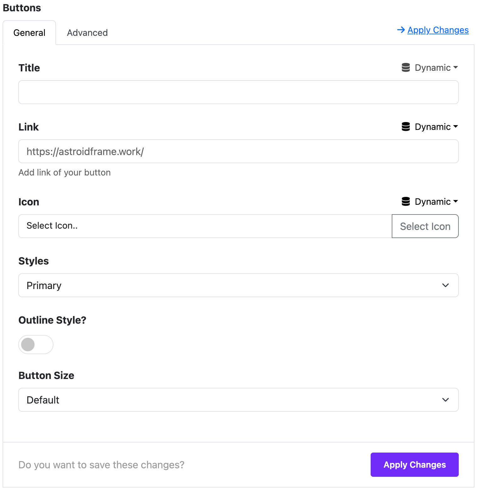
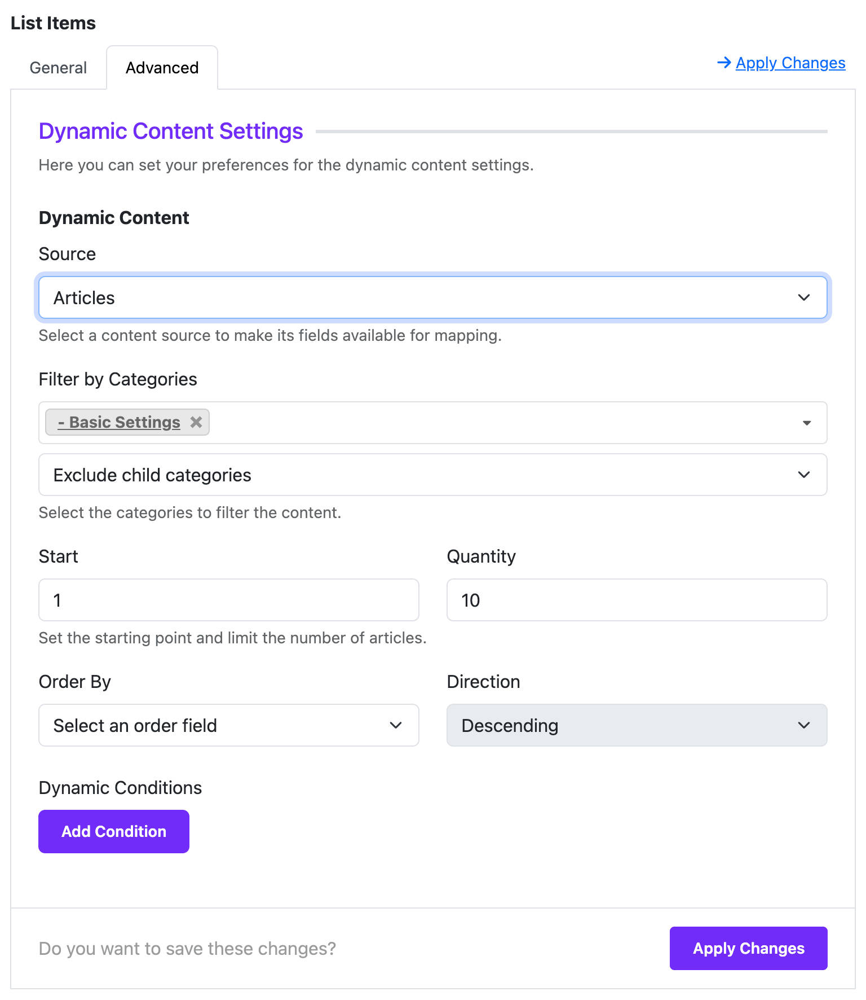
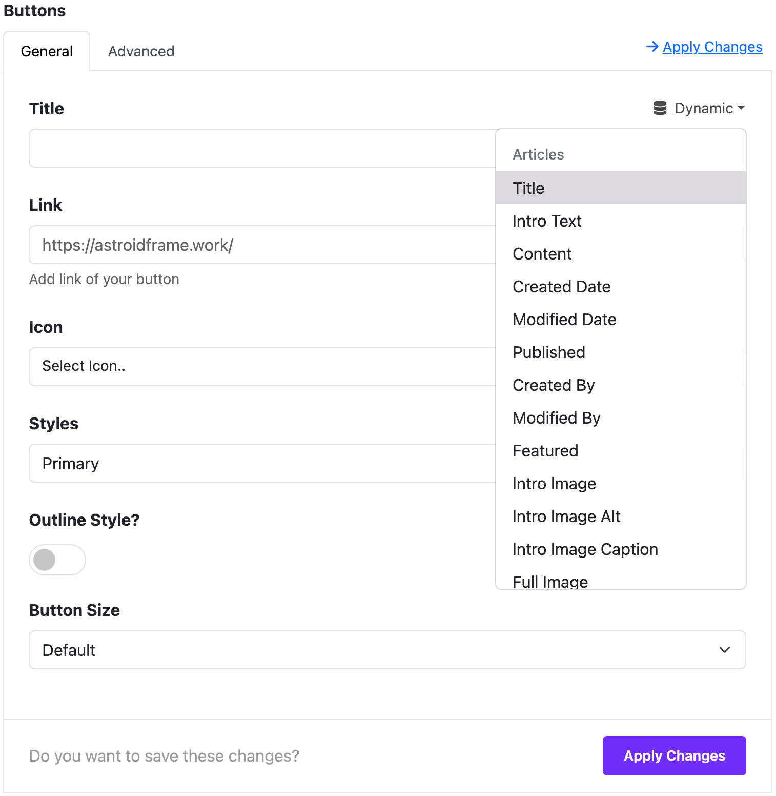
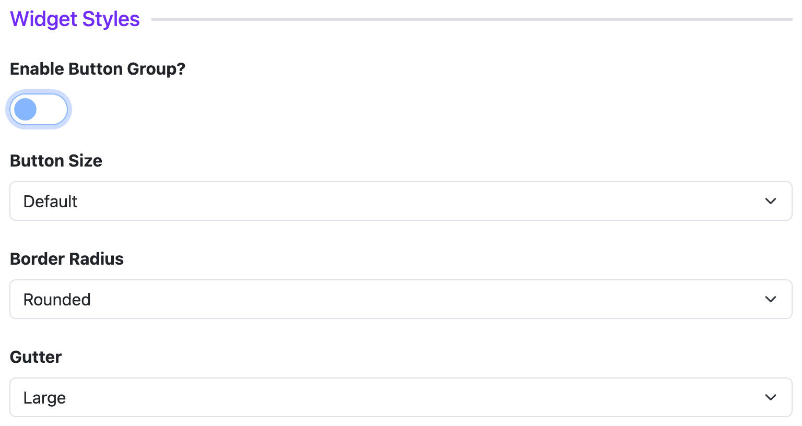

# Button

The **Button Widget** in Astroid Framework allows you to create stylish, customizable buttons that link to internal or external pages. You can also configure icons, styles, sizes, and even dynamic content for enhanced flexibility.

## 📌 Where to Find It

Navigate to your **Astroid Layout Builder**:
1. Go to your Joomla **Administrator Panel**
2. Navigate to: `System` → `Site Template Styles` → Click on your **Astroid template**
3. Click the **“Template Options”** button
4. Open the **Layout** tab
5. Launch the **Layout Builder**

---

## ⚙️ General Settings

These settings apply to each button you add:

### Title
- This is the visible label of the button.

### Link
- The URL the button will point to.
- You can use any internal or external link (e.g., `https://astroidframe.work/`).

### Link Target
- Choose how the link opens:
    - `Default`: Follows the normal behavior.
    - `_blank`: Opens in a new window/tab.
    - `_parent`: Opens in the parent frame.
    - `_top`: Opens in the full window.

### Icon
- Add an icon next to the button label.
- You can choose from the Astroid icon set.

### Icon Position
- Set the icon position:
    - `First`: Before the text.
    - `Last`: After the text.

### Style Presets
- Choose from default Bootstrap button styles:
    - Primary, Secondary, Success, Danger, Warning, Info, Light, Dark, Link, Text, Custom.

### Custom Style (when selected)
If "Custom" is selected:
- **Color / Hover Mode**: Choose between setting regular or hover colors.
- **Text Color**: Customize button text color.
- **Background Color**: Customize button background.
- **Outline**: Toggle an outline style.

### Dynamic Content Settings (Optional)

Accordion Widget supports **Dynamic Content**, allowing each accordion item to load content automatically from other sources like Joomla articles, Joomla categories, or Joomla Users.

#### 🧠 What is Dynamic Content?
Instead of manually writing content for each item, you can link it to:
- A specific **article**
- A **category**
- Or Users source

#### ⚙️ How to Enable Dynamic Content
1. Under each Accordion Item, select **Advanced Settings** tab
2. Expand the **Dynamic Content Source** selection
3. Choose your desired **Dynamic Content Source**

#### 🔧 Available Dynamic Content Sources
- Joomla Articles
- Joomla Categories
- Joomla Users

#### 📌 Priority of Content
If **Dynamic Content** is enabled for an item, it will **override** the manually written content field.

#### 📝 Use Case Example
You want to display a list of tutorials from a Joomla category. Instead of writing each one manually:
- Click to **Dynamic** icon in each field
- The system will automatically pull and render the Joomla fields in the button item
- Select a **Joomla Field** as the dynamic source

> 💡 You can mix static and dynamic content — some items can have manually entered content, and others can pull from dynamic sources.

---

## 🎨 Widget Styles

### Button Group

- Toggle to group multiple buttons together for aligned display.

---

### Button Size
- Default
- Large (`btn-lg`)
- Small (`btn-sm`)
- Custom
  - Font family, font size, and line height can be adjusted.
  - When size is set to Custom, you can manually adjust padding.

### Border Radius
- Choose from:
    - Rounded (default)
    - Square (`rounded-0`)
    - Circle (`rounded-pill`)

### Gutter
- Adjust spacing between buttons in group layout.

---

## 📄 Page Assignment

Control where the button widget appears:
- All Pages
- No Pages
- Selected Menu Items

When choosing “Selected Menu Items”, a menu selector will appear.

---

## ✅ Summary

Button Widget offers:
- Customizable labels, links, icons
- Bootstrap styling & custom design
- Flexible layout & visibility settings
- Integration with dynamic content

Use this widget to enhance user navigation and call-to-action performance on your Joomla site.