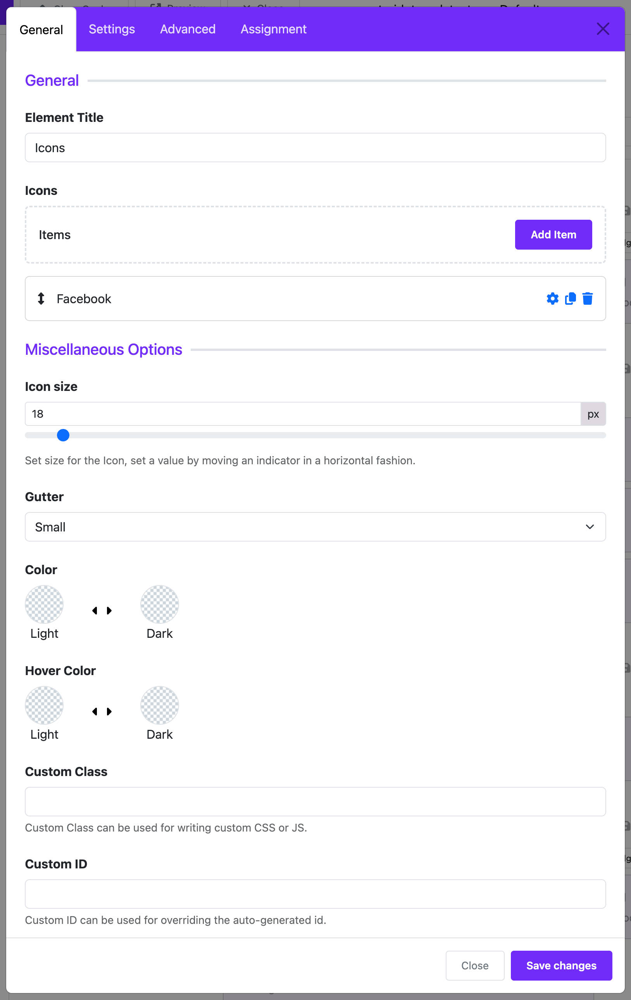
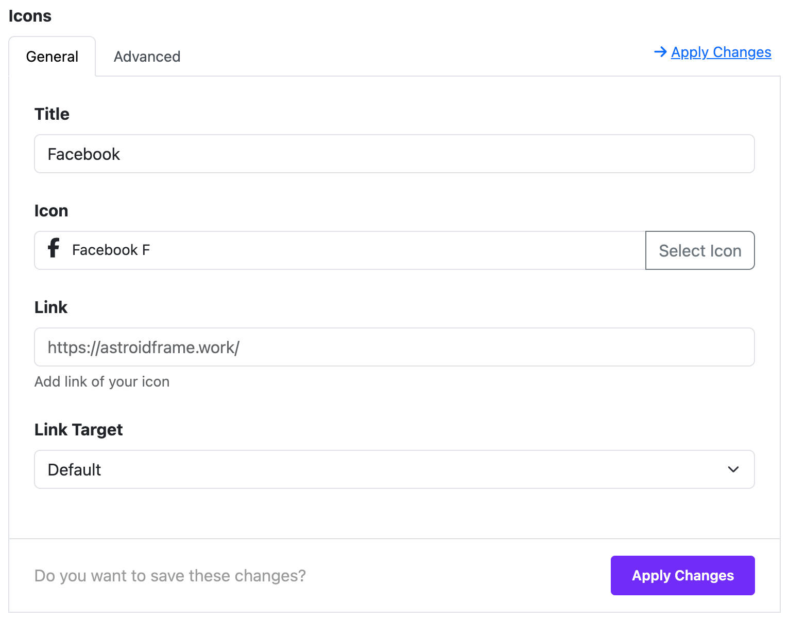

# Icons

The **Icon Widget** in the Astroid Framework allows you to display a collection of icons with links, custom colors, and tooltips. It’s ideal for showcasing social media icons, feature highlights, or quick links.

## 📌 Purpose
Use this widget to insert a customizable set of icons into your layout with optional text labels, links, and hover effects.

---

## 🛠️ How to Use

### 1. Add the Icon Widget
In your Astroid layout builder:
- Click **Add Widget**
- Select **Icons Widget** from the list

---

## ⚙️ Widget Configuration Options

### 🔧 General Settings

- **Title (`title`)**  
  The heading or tooltip for the icon. This can be left blank.

- **Icon (`icon`)**  
  Choose from the built-in icon library (FontAwesome or custom icon sets). Example: `fas fa-star`.

- **Link (`link`)**  
  Add a URL to make the icon clickable. Example: `https://facebook.com`.

- **Target (`target`)**  
  Choose how the link will open:
    - `Default`: Use browser default
    - `_blank`: Open in new tab
    - `_parent`: Open in parent frame
    - `_top`: Open in the full body of the window

You can add **multiple icons** in a list format using the subform under this section.

---

### 🎨 Misc Options

These settings control appearance and spacing:

- **Icon Size (`icon_size`)**  
  Set the size of the icons (in pixels). Default is `18px`. Adjustable from `1` to `300`.

- **Gutter (`icon_gutter`)**  
  Controls the spacing between icons:
    - `0`: Collapse
    - `1`: Extra Small
    - `2`: Small
    - `3`: Medium
    - `4`: Large
    - `5`: Extra Large

- **Color (`color`)**  
  Pick the default icon color.

- **Hover Color (`color_hover`)**  
  Choose a different color for when the icon is hovered.

---

### ⚡ Advanced (Dynamic Content)

If using **dynamic content**:
- Enable content source under `Dynamic Content Source`.
- You can bind dynamic content to icon titles, links, or icons.

---

### 📑 Assignment Settings

Determine where the widget appears:

- **Assignment Type**
    - `All Pages`: Show widget site-wide.
    - `No Pages`: Hide widget.
    - `Selected Pages`: Choose specific menu items to display the widget on.

---

## ✅ Example Use Case

You want to display three social media icons (Facebook, Twitter, Instagram):
1. Add three icon items.
2. Set appropriate icons: `fab fa-facebook-f`, `fab fa-twitter`, `fab fa-instagram`.
3. Link each to the respective URLs.
4. Set size to `24px` and gutter to `3` (medium).
5. Customize colors to match your branding.

---

## 📝 Notes
- Icons are rendered using icon fonts. Make sure your template includes the appropriate font library (e.g., FontAwesome).
- This widget is responsive and lightweight.