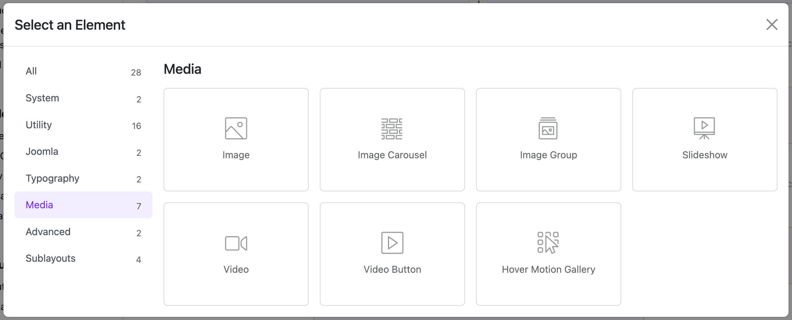

# Image

The **Image Widget** allows you to easily add an image to your Joomla website using the Astroid Framework. You can customize its appearance, effects, borders, and even add a link to it.

---

## 🔍 Step 1: Add the Image Widget to the Layout

1. Go to your Joomla **Administrator Panel**
2. Navigate to: `System` → `Site Template Styles` → Click on your **Astroid template**
3. Click the **“Template Options”** button
4. Open the **Layout** tab
5. Launch the **Layout Builder**
6. Click the ➕ button where you want to add an image.
7. Select **Image** from the widget list.

---

## ⚙️ Step 2: Configure the Image Widget

After adding the widget, click the ⚙️ (settings) icon to open the configuration panel.

### 1. 🖼️ Choose Image

- **Image Color Mode**: Select *Light* or *Dark*.
- **Light Image**: Upload the image for light mode.
- **Dark Image**: Upload the image to be used in dark mode.

> 💡 If your site doesn’t use dark mode, you only need to set the Light image.

---

### 2. 📝 Add Image Caption

- **Figure Caption**: Optional short text displayed below the image.

---

### 3. 🔗 Add Link to the Image (Optional)

- **Use Link**: Enable this if you want the image to be clickable.
- **Link**: Enter the destination URL (e.g., `https://astroidframe.work`).
- **Target**: Choose how the link opens:
    - Default
    - Open in new tab
    - Open in parent frame
    - Open in full window

---

### 4. 🎨 Customize Image Style

| Option | Description |
|--------|-------------|
| **Display** | Choose display type: Block, Inline, Flex, etc. |
| **Border Radius** | Choose corner style: Rounded, Circle, Pill. |
| **Rounded Size** | If "Rounded" is selected, pick the radius size. |
| **Box Shadow** | Add a shadow effect around the image. |
| **Hover Effect** | Add visual effects on hover (e.g., flash, fade-in). |
| **Hover Transition** | Add animation such as scale, rotate, float, wobble... |

---

## 📌 Step 3: Assign Widget to Specific Pages

You can choose where the widget will be displayed:

- **All pages**
- **No pages**
- **Specific pages only** → Select specific menu items

---

## 🎯 Example Use Cases

- ✅ Add a promotional banner
- ✅ Display a partner logo
- ✅ Show a team or personal photo with hover effects
- ✅ Use an image as a navigation link

---

## ✅ Tips

- Use both light and dark images to make sure the image looks good in all modes.
- Combine hover effects and transitions to create attractive animations.