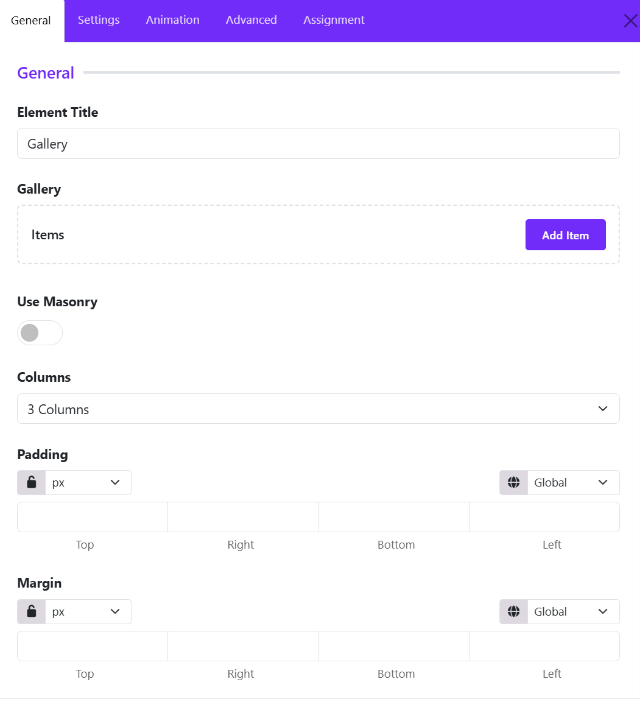
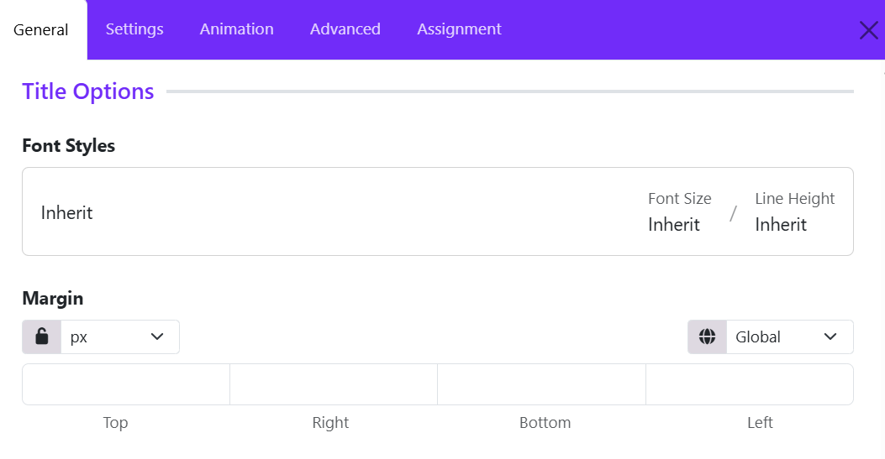
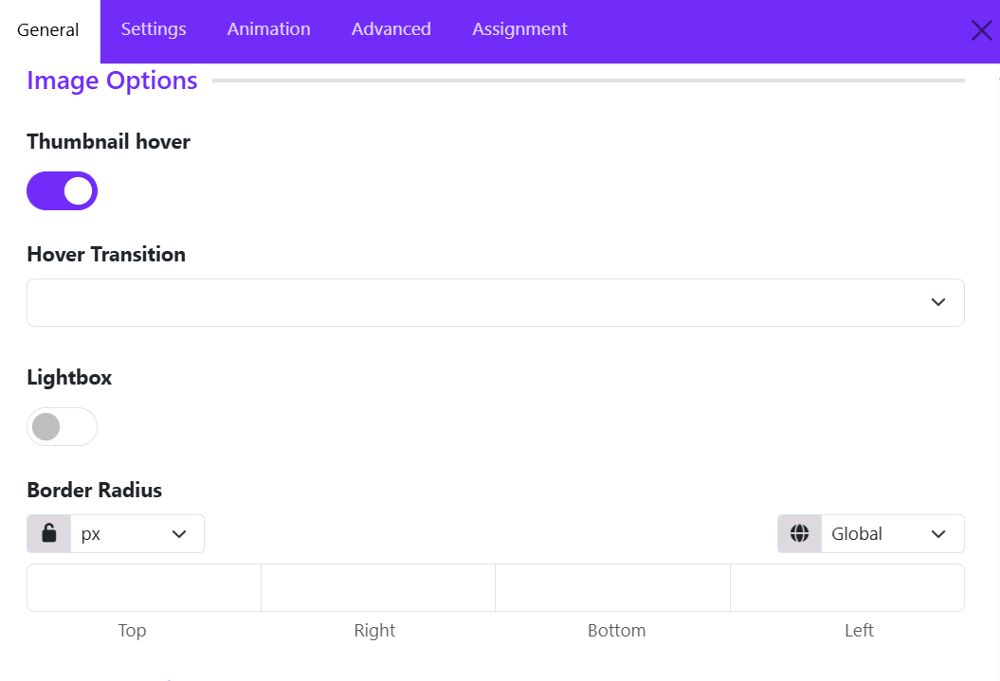
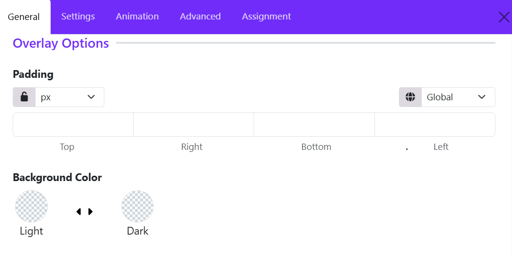

# Gallery

The Gallery Widget in Astroid Framework is a visual content widget that allows you to display a collection of images in an attractive and responsive gallery layout. It is designed to showcase portfolios, photography, projects, products, events, team activities, and other visual content without requiring additional Joomla extensions.

## General Settings

**Gallery Widget** allows you to add and manage gallery items while controlling the overall gallery layout and presentation. These settings form the foundation of your image gallery and determine how visitors interact with your visual content.

### Gallery Items

The Gallery Items area is where you create and manage the images displayed in the gallery.

Click **Add Item** to create a new gallery entry. Each gallery item typically includes:

* **Image** – Upload or select an image from the Joomla Media Manager.
* **Title** – Add a title for the image.
* **Description** – Include additional information or captions.
* **Link** – Optionally link the image to a page, URL, or lightbox.
* **Category/Filter Tag** – Assign categories for gallery filtering (if supported).

You can add unlimited gallery items and reorder them using drag-and-drop controls.

### Use Masonry

The Use Masonry option enables a masonry-style layout for gallery images.

* Disabled: Images are displayed in a standard grid layout with equal row alignment.
* Enabled: Images are arranged dynamically based on their height, creating a Pinterest-style layout.

#### Benefits of masonry

- Better use of available space.
- Ideal for galleries containing images with different aspect ratios.
- Creates a modern and visually engaging layout.

### Columns

Define how many columns appear in the gallery (1-6 columns).

### Padding

The Padding setting controls the internal spacing inside the Gallery widget container. This creates consistent spacing between the gallery content and the widget boundaries.

You can define values for: Top, Right, Bottom, Left. 

### Margin

The Margin setting controls the external spacing around the Gallery widget. This adds breathing room above and below the gallery section.

You can set individual values for: Top, Right, Bottom, Left.

## Title Settings

The **Title Settings** section allows you to customize the appearance and spacing of image titles displayed in the Gallery widget. These options help you maintain consistent typography and improve the overall presentation of gallery captions.

### Font Styles

The **Font Styles** control lets you customize the typography used for gallery item titles.

#### How to Configure

1. Click on the **Font Styles** field.
2. Configure the desired typography settings, such as:

  * Font Family
  * Font Size
  * Font Weight
  * Line Height
  * Letter Spacing
  * Text Transform
  * Font Style

#### Inherit Option

By default, the title uses **Inherit**, meaning it adopts the typography settings defined by your template or global theme styles.

**Recommended:** Use the inherit setting when you want gallery titles to match the overall website design.

### Margin

The **Margin** setting controls the spacing around gallery titles.

* You can define individual margin values for: Top, Right, Bottom, Left.
* Choose from various measurement units: px, em, rem, or %.
* Click the **lock icon** to apply the same margin value to all four sides.
* Unlock the values to customize each side independently.

## Image Settings

The **Image Settings** section allows you to control the appearance and interaction of gallery images. These options help you create engaging image galleries with hover effects, lightbox functionality, and custom styling.

### Thumbnail Hover

The **Thumbnail Hover** option enables hover effects on gallery images.

When enabled, visual effects are applied when visitors move their mouse over an image thumbnail. 
After enabling the thumbnail hover, you can choose a **Hover Transition**.

#### Benefits

* Makes the gallery more interactive.
* Draws attention to images.
* Creates a modern user experience.

**Recommended**: Enable this option for portfolios, photography galleries, and image showcases.

### Lightbox

The **Lightbox** option allows images to open in a popup overlay when clicked. Toggle **Lightbox** to **ON**.

#### How It Works

When visitors click a gallery image:

* The image opens in a fullscreen overlay.
* The page remains in the background.
* Users can focus on the image without leaving the current page.

#### Benefits

* Improves image viewing experience.
* Ideal for high-resolution images.
* Allows visitors to browse gallery images more comfortably.

#### Recommended

Enable Lightbox for:

* Photography websites
* Portfolio galleries
* Travel galleries
* Event galleries

### Border Radius

The **Border Radius** setting controls the roundness of image corners.

You can set values individually for: Top, Right, Bottom, Left.

#### Examples

| Value | Result                 |
| ----- | ---------------------- |
| 0px   | Square corners         |
| 5px   | Slight rounding        |
| 10px  | Soft rounded corners   |
| 20px  | Modern card appearance |
| 50px+ | Highly rounded corners |

## Overlay Settings 

The **Overlay Settings** section allows you to control the appearance of the content overlay displayed on gallery images.

### Padding

The **Padding** setting controls the internal spacing between the overlay content and the edges of the overlay container.

Available Options:

* **Top** – Space above the content.
* **Right** – Space to the right of the content.
* **Bottom** – Space below the content.
* **Left** – Space to the left of the content.

**Features:**

* Choose a measurement unit (such as px).
* Use the **lock icon** to apply the same value to all four sides.
* Unlock the values to define different spacing for each side.
* Responsive controls allow different padding values for desktop, tablet, and mobile devices.

### Background Color

The **Background Color** option defines the overlay background color behind the gallery content.

* **Light Mode Color** – Background color used when the website is displayed in light mode.
* **Dark Mode Color** – Background color used when dark mode is enabled.

