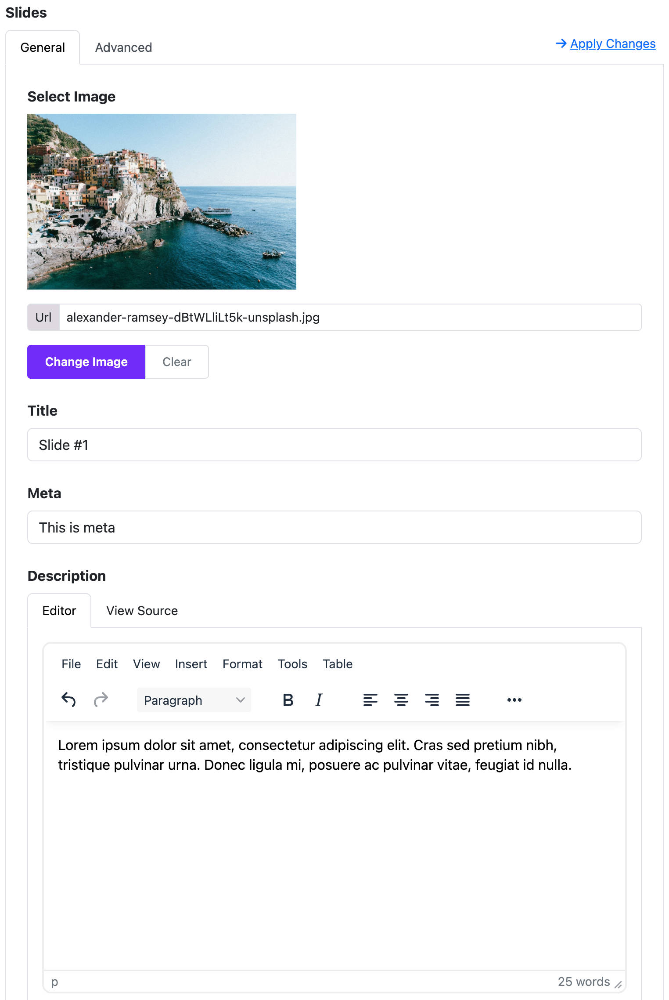

# Slideshow

The **Slideshow Widget** in Astroid Framework allows you to create visually engaging image slideshows with overlays, titles, descriptions, and links. This guide will walk you through configuring the widget and utilizing its features effectively.

---

## 📌 How to Add Slideshow Widget

1. Go to your **Layout Builder** in the Astroid Template.
2. Click **Add Widget**.
3. Choose **Slideshow** from the widget list.

---

## ⚙️ General Settings

### 🖼️ Slides
You can add multiple slides, each with the following options:

- **Image**: Upload or select an image.
- **Title**: Add a heading for the slide.
- **Meta**: Optional metadata (e.g., date or category).
- **Description**: Add rich text content using a WYSIWYG editor.
- **Link**: URL to open when clicking the slide.
- **Link Text**: Button label, e.g., "Read More".
- **Link Target**: Choose where the link opens (`_blank`, `_parent`, etc.).

---

## 🎨 Slideshow Options

- **Slider Height**: Set the height in `vh` or `px`.
- **Minimum Height**: Minimum height in pixels.
- **Effect Type**: Choose `carousel` or `fade` transition.
- **Autoplay**: Enable automatic slide transitions.
- **Interval**: Time (in seconds) between auto slides (only when autoplay is enabled).
- **Controls**: Show next/prev navigation arrows.
- **Indicators**: Show navigation dots.
- **Border Radius**: Choose `Rounded`, `Square`, `Circle`, or `Pill`.
- **Rounded Size**: Available when `Rounded` is selected.
- **Box Shadow**: Add a shadow effect.
- **Hover Shadow**: Apply shadow effect on hover.

---

## 🎭 Overlay Options

- **Max Width**: Set a maximum width for content overlay (e.g., small, medium).
- **Position**: Control the position of overlay content (e.g., top-left, center).
- **Text Color**: Choose `Light` or `Dark` for text visibility.
- **Overlay Type**: Use `Color`, `Gradient`, or `None`.
- **Overlay Color/Gradient**: Set background color or gradient if enabled.
- **Padding**: Default, Small, Large, or Custom.
- **Custom Padding**: Use if “Custom” padding is selected.

---

## 🔤 Title, Meta, Content Styling

These sections allow you to customize the appearance of text:

### Title Options:
- **HTML Element**: Choose heading level (`h1` to `h6`, or `div`).
- **Font Style**: Set font size, weight, etc.
- **Margin**: Set space around the title.

### Meta Options:
- **Font Style**: Similar to title.
- **Margin**: Spacing for meta.
- **Position**: Display meta info before or after the title.

### Content Options:
- **Font Style**: Customize body text style.

---

## 🔘 Read More Button (Link)

- **Button Style**: Select style (Primary, Success, Warning, etc.).
- **Outline Style**: Enable outline version of button.
- **Size**: Default, Large, or Small.
- **Border Radius**: Rounded, Square, or Circle.

---

## 📄 Page Assignment

You can control where the widget appears:
- **All Pages**
- **No Pages**
- **Selected Pages**: Choose specific menu items.

---

## 🔄 Dynamic Content (Advanced)

If you're using **Dynamic Content**, you can:
- Enable `Dynamic Content Settings` inside each slide.
- Choose content source (articles, categories, etc.) dynamically.

---

## ✅ Tips

- Use high-resolution images for better visual impact.
- Ensure contrast between overlay text and image for readability.
- Use minimal text per slide to maintain focus.