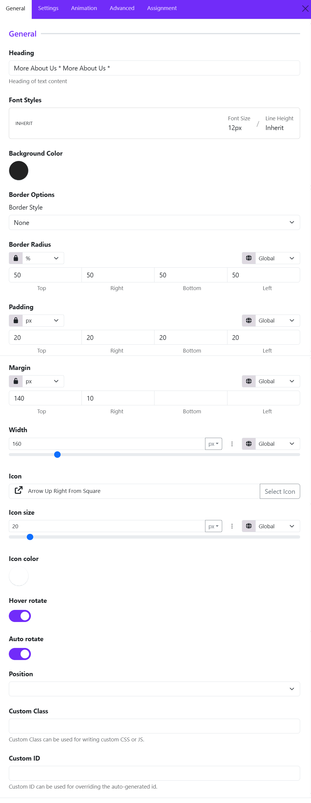

# Circle Text

The **Circle Text Widget** allows you to create rotating circular text combined with icons, background styling, spacing controls, and animation effects. 

The Circle Text Widget is perfect for:

* “Read More” buttons
* Hero section decorations
* Scroll indicators
* Interactive CTA elements
* Portfolio showcases
* Agency and creative websites
* Modern sports or fitness templates

## General Settings

### Heading

Enter the text that will appear in the circular layout. The text automatically wraps around the circle shape to create the rotating circular text effect.

Example: More About Us * More About Us *

### Font Styles

Customize the typography of the circular text.

Available controls include:

* Font family
* Font size
* Font weight
* Line height
* Text transform
* Letter spacing

### Background Color

Choose the background color of the circular container.

### Border Style

Select the border type around the circle.

Common options:

* None
* Solid
* Dashed
* Dotted
* Double

### Border Radius

Controls the roundness of the widget container.

For example: 

* Unit is set to: %
* All values are: 50

This creates a perfect circle.

### Padding

Adds inner spacing between the text/icon and the widget border.

Example:

* Higher padding creates more breathing room
* Lower padding makes the content tighter

### Margin

Controls spacing outside the widget.

Useful for:

* Separating the widget from nearby elements
* Adjusting vertical positioning

Example: 

* Top margin: 140px
* Right margin: 10px

### Width

Defines the overall size of the circular widget.

Example:

* Small width for compact buttons
* Large width for hero section decorations

### Icon

Choose an icon displayed in the center of the circle. You can select an icon from the list.

### Icon Size

Adjust the icon dimensions. Ex: 20px

Larger icons create stronger visual focus.

### Icon Color

Choose the icon color independently from the text color.

Common combinations:

* White icon on dark background
* Brand-colored icon on light background

### Hover Rotate

When enabled, the circular text rotates when users hover over the widget.

Useful for:

* Interactive UI effects
* Modern portfolio websites
* Creative landing pages

### Auto Rotate

Automatically rotates the circular text continuously without hover interaction.

Ideal for:

* Hero sections
* Promotional banners
* Animated design elements

### Position

Controls the alignment or placement of the widget inside its container.

Depending on the layout system, this includes: **Relative** and **Absolute**

