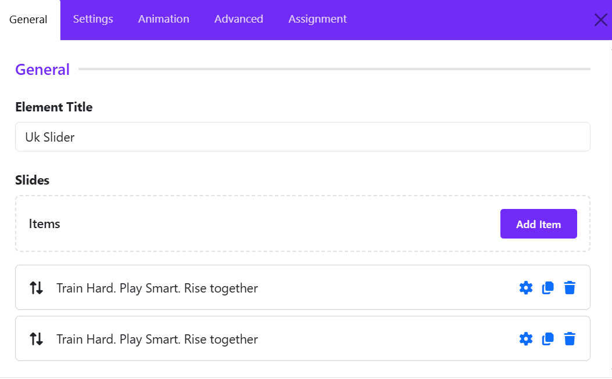
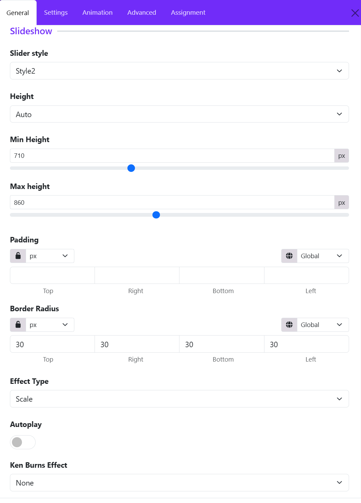
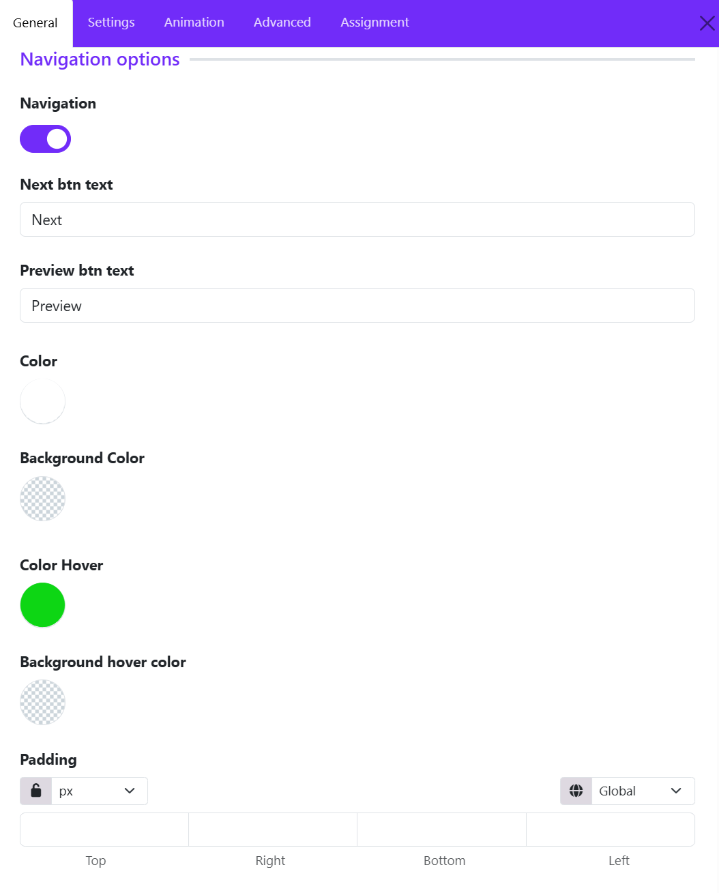
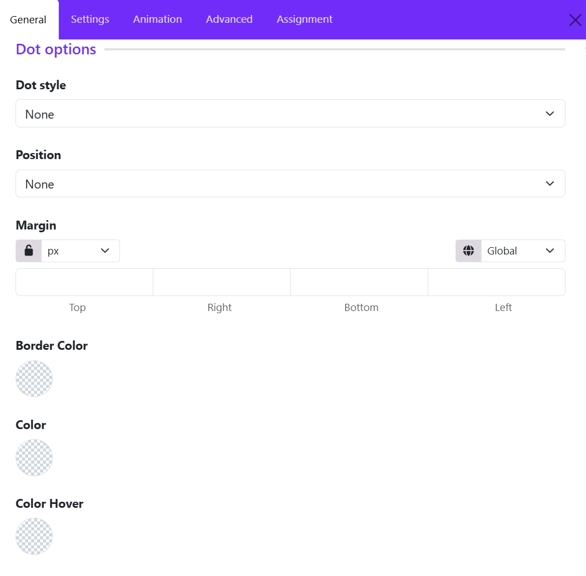
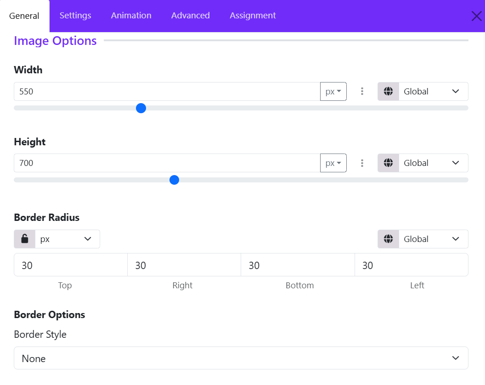
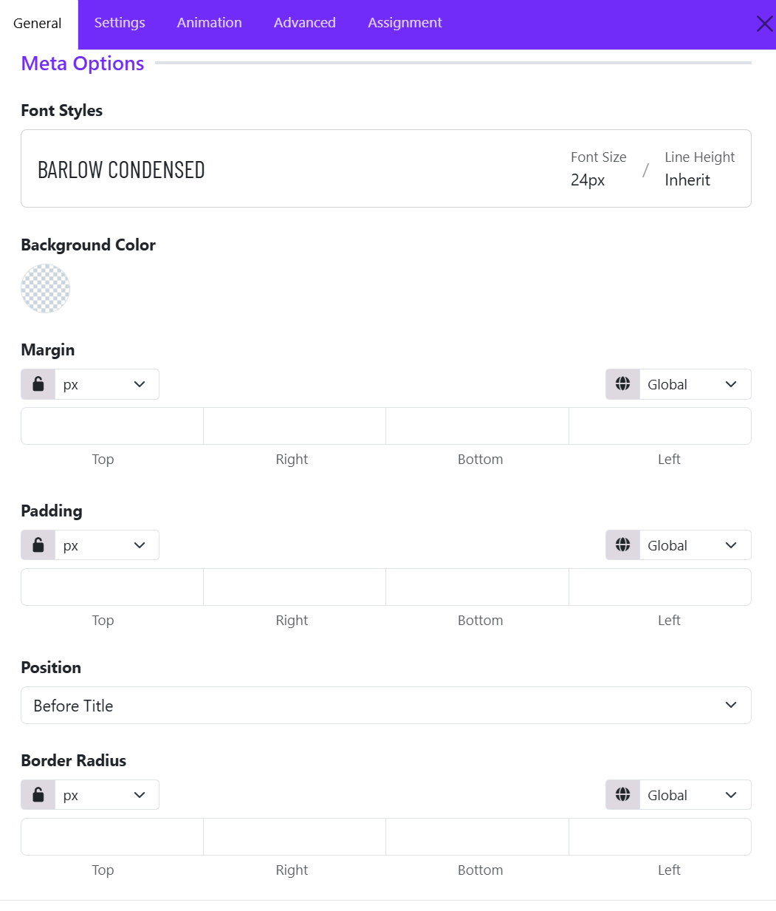
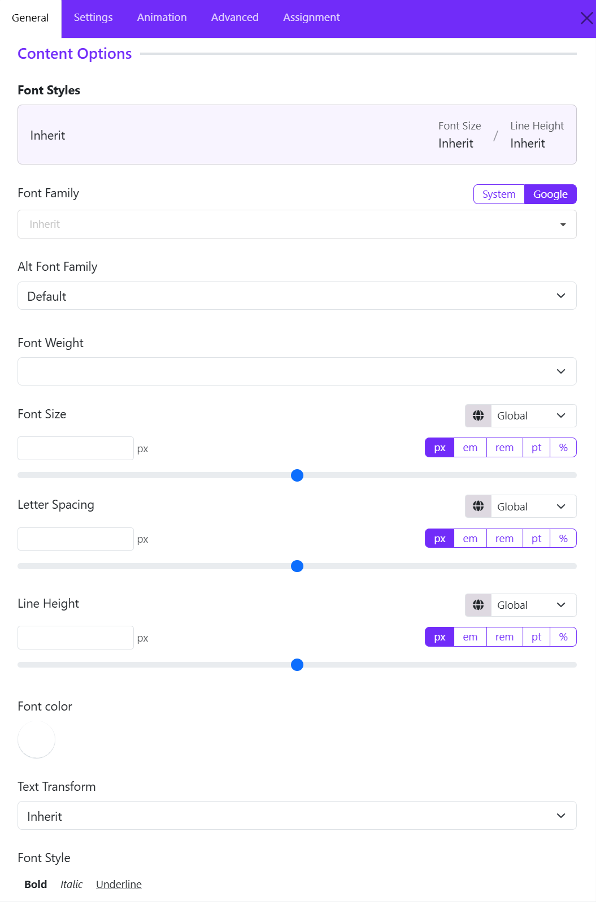
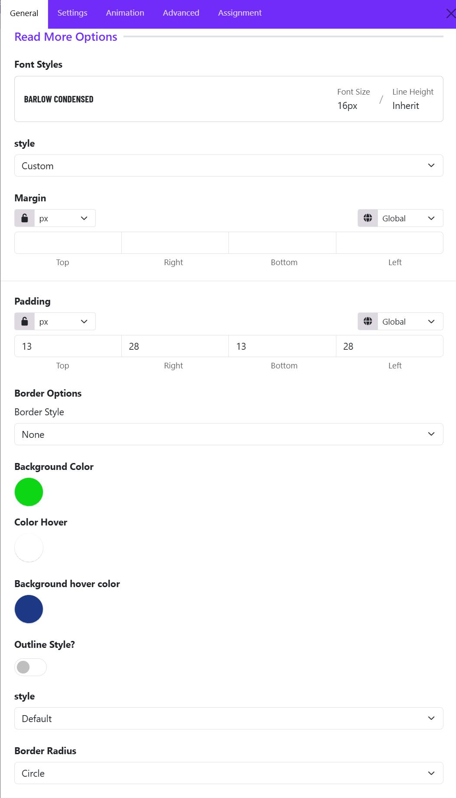

# UK Slider

The Slideshow is fully responsive and supports touch and swipe navigation as well as mouse drag for desktops. When swiping between slides, the animation literally sticks at your fingertips or mouse cursor. It accelerates to keep up with your pace when you click through the previous and next navigation.
Create amazing create beautiful and dynamic image slideshows with titles, descriptions, buttons, and animation effects.

Once you add the **UK Slider**, you can configure it under the following sections:

## 1. **General Settings**

After clicking **Add New**, a popup window will appear where you can configure the slide content and settings.

#### Element Title

Enter a name for the slide item.
This title is mainly used internally to help identify the slide in the builder.

#### Image Type

Choose the content type for the slide. Available options typically include:

* Image
* Video
* Other supported media types depending on the widget version

#### Select Image

Upload a new image or select one from the Joomla Media Library. Options available:

* **Change Image** – Replace the current image
* **Clear** – Remove the selected image

For best results:

* Use high-quality landscape images
* Keep image dimensions consistent across all slides

#### Title

Add the main heading displayed on the slide.

Example:

> Train Hard. Play Smart. Rise together

#### Meta

Enter optional meta information such as:

* Category
* Subtitle
* Date
* Tagline

#### Description

Add the slide content using the visual editor. You can:

* Insert formatted text
* Add links
* Use HTML via the **View Source** tab

Keep descriptions short and readable for better slider presentation.

#### Link

Enter the destination URL for the slide button.

Examples:

* Internal page link
* External website
* Anchor link

#### Link Text

Define the button label shown on the slide.

Example: "Become a member"

#### Link Target

Choose how the link opens. Common options you can choose: 

* Default
* Same Window
* New Window

## 2. **Slideshow Settings**

The **Slideshow Settings** allows you to control the appearance, sizing, animation, and behavior of the slideshow. These settings help you create modern hero sliders, promotional banners, and interactive image presentations.

#### Slider Style

Choose a predefined layout style for the slideshow. Different styles affect the structure of the slide content, overlay positioning, typography, and navigation appearance.

#### Height

Define how the slideshow height behaves.

* **Auto**: The slider automatically adjusts based on the content or image dimensions.
* Other height modes may allow fixed or viewport-based sizing for full-screen hero sections.

#### Min Height

Set the minimum height of the slideshow in pixels.
This ensures the slider maintains a consistent vertical size even when content is minimal.

Example:

* "710px" keeps the slider tall enough for large hero banners.

#### Max Height

Limit the maximum height of the slideshow.
This prevents oversized images from stretching the section too much on large screens.

Example:

* "860px" prevents the slider from becoming excessively tall on widescreen displays.

#### Padding

Add internal spacing around the slideshow content. Padding is useful for improving text readability and creating balanced layouts.

You can:

* Apply equal padding to all sides using the lock icon.
* Set individual values for: Top, Right, Bottom, Left.
* Choose responsive units such as px, %, em, or rem.

#### Border Radius

Control the roundness of the slideshow corners.

* Higher values create softer rounded corners.
* A value like "30px" produces a modern card-style slider appearance.

You can:

* Link all sides together
* Or customize each corner independently.

#### Effect Type

Choose the transition animation between slides. The selected effect determines how slides animate when changing. Common effects include:

* Scale
* Fade
* Slide
* Pull  
* Push

#### Autoplay

Enable automatic slide transitions.

When enabled:

* Slides rotate automatically after a specified interval.
* Ideal for hero banners and promotional showcases.

When disabled:

* Users manually navigate using arrows or indicators.

#### Ken Burns Effect

Apply cinematic motion effects to slide backgrounds. The Ken Burns effect adds subtle movement to static images, making the slideshow feel more dynamic and engaging.
Options usually include:

* None
* Top Left
* Top Center
* Top Right
* Center Left
* Center Center
* Center Right
* ...

## 3. **Navigation Settings**

The **Navigation Options** allows you to control the slider navigation buttons, including their visibility, labels, colors, hover effects, and spacing. These settings help create a more interactive and user-friendly slideshow experience.

#### Navigation

Enable or disable the slider navigation controls.

When enabled:

* Previous and next navigation buttons appear on the slideshow.
* Visitors can manually move between slides.

When disabled:

* Navigation arrows/buttons are hidden, leaving only autoplay or swipe navigation if enabled.

#### Next Button Text

Customize the label displayed for the next navigation button.

Example: Next, Continue or View More

This allows you to match the slider navigation with your website’s tone and branding.

#### Preview Button Text

Set the label for the previous navigation button. Custom labels are useful for multilingual websites or creative slider designs.

Example: Preview, Previous, Back

#### Color

Define the default text or icon color of the navigation buttons.

You can use:

* Solid colors
* Theme colors
* Custom branding colors

This helps ensure the navigation remains visible against slideshow backgrounds.

#### Background Color

Set the background color of the navigation buttons. Transparent backgrounds are commonly used for modern minimal sliders.

#### Color Hover

Choose the text or icon color when users hover over the navigation buttons.

Hover colors improve:

* Visual feedback
* User interaction
* Accessibility

#### Background Hover Color

Define the background color displayed when hovering over navigation controls. This creates smooth interactive effects and improves button visibility during mouse interaction.

#### Padding

Control the internal spacing of the navigation buttons.

You can:

* Apply equal padding to all sides
* Customize: Top, Right, Bottom, Left.
* Use responsive units such as: px, %, em, rem.

Larger padding creates bigger modern navigation buttons, while smaller values keep the design compact.

## 4. **Dots Settings**

The **Dot Options** allows you to configure the slideshow pagination dots. These dots help users identify the current slide and quickly navigate between slides.

#### Dot Style

Choose the appearance style of the navigation dots. Available styles may include:

* None
* Dotnav
* Thumbnav
* Title

When set to **None**, the dot navigation is completely hidden. Dot styles help match the slider design with your website’s visual identity.

#### Position

Control where the dot navigation appears within the slideshow. Common positions include:

* None
* Top Left
* Top Center
* Top Right  
* Bottom Center
* Bottom Left
* Bottom Right
* ...

When set to **None**, the dots are not displayed. Proper positioning improves usability without distracting from the slide content.

#### Margin

Adjust the spacing around the dot navigation container.

You can:

* Link all sides together using the lock icon
* Set individual values for: Top, Right, Bottom, Left.
* Use different responsive units such as: px, %, em, rem

Margins help create better alignment and spacing between the dots and the slideshow content.

#### Border Color

Define the border color of the navigation dots. Transparent borders can also be used for minimal designs.

#### Color

Set the default fill or icon color of the navigation dots. This controls the appearance of inactive dots and helps users identify available slides.

#### Color Hover

Specify the color shown when users hover over the dots. You can use brighter or accent colors to highlight active interaction.

## 5. **Overlay Settings**

The **Overlay Options** section of the UK Slider widget in the Astroid Framework controls how slide content is displayed on top of slideshow images. These settings help you create visually engaging hero sections with properly aligned text, buttons, and overlays.

#### Max Width

Define the maximum width of the overlay content container. Available options may include:

* Inherit
* xxsmall
* xsmall  
* Small
* Medium
* Large
* xlarge
* xxlarge

When set to **inherit**, the overlay width follows the parent container or theme layout settings.

Using a max width helps:

* Improve text readability
* Prevent overly stretched content on large screens
* Create balanced hero layouts

#### Padding

Control the internal spacing inside the overlay content area.

You can:

* Apply equal padding to all sides
* Customize individual values for: Top, Right, Bottom, Left.
* Select responsive units such as: px, %, em, rem

In the example:

* A bottom padding value of 80px creates additional spacing beneath the overlay content.

Padding is especially useful for:

* Separating text from image edges
* Improving readability
* Creating modern spacious layouts

#### Alignment

Set the text alignment of the overlay content. Common options include:

* Left
* Center
* Right
* Justify

Example:

* **Left alignment** is commonly used for professional hero banners and promotional sections.

#### Position

Positioning helps guide visual focus and improves composition with background images.
Choose where the overlay content appears within the slideshow. Common positions include:

* Top Left
* Top Center
* Top Right
* Center
* Bottom Left
* Bottom Center
* Bottom Right
* ...

Example:

* **Bottom Left** positions the content near the lower-left corner of the slide.

#### Background Color

Set a background color behind the overlay content. Overlay backgrounds help maintain readability on image-heavy slides.

#### HTML Element

Define the HTML tag used for the overlay heading or main text element. Common options include: H1, H2, H3, H4, H5, H6, DIV

Example: **H3** creates a semantic heading structure suitable for section titles inside the slider.

## 6. **Title Settings**

The **Title Options** allows you to customize the appearance and spacing of slide titles. These settings help create visually impactful headings for hero banners, promotional sliders, and featured content sections.

#### Font Styles

Configure the typography styling of the slide title. This section typically allows you to control:

* Font family
* Font weight
* Font size
* Line height
* Text transformation
* Letter spacing
* Responsive typography settings

#### Margin

Adjust the outer spacing around the title element.

You can:

* Link all margin values together using the lock icon
* Set individual margins for: Top, Right, Bottom, Left.
* Use responsive units such as: px, %, em, rem.

In the example:

* Top margin: 0
* Right margin: 300
* Bottom margin: 40
* Left margin: 0

## 7. **Image Settings**

The **Image Options** allows you to control the size, shape, and border styling of images displayed within each slide. These settings are particularly useful when using slider layouts that feature separate image elements alongside text content.

### Width

Set the width of the slide image. (Ex: 550px)

You can:

* Enter a custom value manually.
* Use the slider control for quick adjustments.
* Choose different units such as: px, %, em, rem.
* Configure responsive values for different device sizes using the responsive control.

### Height

Define the height of the slide image. Example: **700px**.

Setting a fixed height creates a consistent appearance across all slides, even when images have different original dimensions.

### Border Radius

Control the roundness of the image corners.

You can:

* Apply the same radius to all corners using the lock option.
* Set individual values for: Top, Right, Bottom, Left.
* Choose the measurement unit.

### Border Style

Choose the type of border applied to the image.

Common options include:

* None
* Solid
* Dashed
* Dotted
* Double
* Groove
* Ridge

### Responsive Controls

Several image settings include responsive controls, allowing you to define different values for:

* Desktop
* Tablet
* Mobile devices

This ensures images remain visually balanced and properly scaled across all screen sizes.

## 8. **Meta Settings**

The **Meta Options** allows you to customize the appearance and placement of the meta text displayed on each slide. Meta text is typically used for supplementary information such as dates, categories, labels, authors, or short descriptions that appear alongside the slide title.

#### Font Styles

This setting controls the typography of the meta text.

* Select a predefined font style or create a custom typography style.
* Configure properties such as:

    * Font family
    * Font size
    * Font weight
    * Line height
    * Letter spacing
    * Text transformation
    * Text color

This allows the meta information to visually match the overall design of the slider.

#### Background Color

Adds a background color behind the meta text.

* Supports solid colors and transparent backgrounds.
* Useful for improving readability when the slider image contains busy or high-contrast areas.

#### Margin

Controls the external spacing around the meta element. (Margins help separate the meta text from surrounding content.
).

Options include:

* Top
* Right
* Bottom
* Left

Additional controls:

* Unit selector (px, em, rem, %, etc.)
* Lock icon to apply the same value to all sides
* Responsive device selector for different screen sizes

#### Padding

Controls the internal spacing inside the meta container. Padding is useful when using a background color to create badges, labels, or highlighted meta blocks.

Options include:

* Top
* Right
* Bottom
* Left

#### Position

Determines where the meta text appears relative to the slide title. This helps control the content hierarchy within the slide overlay.

Available options include:

* **Before Title**
* **After Title**

#### Border Radius

Rounds the corners of the meta container.

Options include:

* Top
* Right
* Bottom
* Left

## 9. **Content Settings**

This setting controls the typography of the main content of the widget. 
You can let the content to inherit the global typography, or click on the setting icon to make custom adjustments. 

* Configure properties such as:

    * Font family: Select the primary font used for the slide content.
    * Alt font family: Defines a fallback font if the primary font cannot be loaded.  
    * Font size: Controls the size of the content text.
    * Font weight: Controls the thickness of the content text.
    * Line height: Controls the vertical spacing between lines of text.
    * Letter spacing: Adjusts the distance between characters.
    * Text transformation: Changes the capitalization style of the content text.
    * Text color: Select the text color for the content.

## 10. **Read More Settings**

The **Read More Options** allow you to customize the appearance and behavior of the call-to-action button displayed on each slide. 

### Font Styles

The Font Styles panel displays the typography currently applied to the Read More button.

Example:

* Font Family: **Barlow Condensed**
* Font Size: **16px**
* Line Height: **Inherit**

You can select a predefined typography style or create a custom one to match your site's design.

### Style

Determines the overall button appearance. You can choose one of options available: 

* Custom
* Primary
* Secondary
* Success
* Danger  
* Link
* ...

The **Custom** style is selected, which unlocks additional styling controls such as colors, padding, and borders.

### Margin

Controls the external spacing around the Read More button. Use margins to create space between the button and nearby content elements.

### Padding

Controls the internal spacing inside the button. Larger padding creates a more prominent and clickable button.

### Border Style

Defines the border appearance of the button. Common options:

* None
* Solid
* Dashed
* Dotted
* Double

### Background Color

Sets the default button background color.

### Color Hover

Controls the text color when a visitor hovers over the button. This creates an interactive visual effect and improves user engagement.

### Background Hover Color

Defines the button background color on mouse hover. Ex: Dark Blue

When users move their cursor over the button, the background changes from the default green to blue. This provides visual feedback that the button is clickable.

### Outline Style

Enables or disables outline button styling.

* Disabled: The button displays a solid background color.
* Enabled: The button may display with transparent background, colored border, and colored text.

### Style

When outline mode is enabled, this dropdown allows you to select the outline appearance.

Common options include:

* Default
* Large
* Small

### Border Radius

Controls the shape of the button corners. Common options include: Rounded, Circle, Square, Custom. 
If you choose Custom, you can adjust the Top, Right, Bottom, Left manually. 

