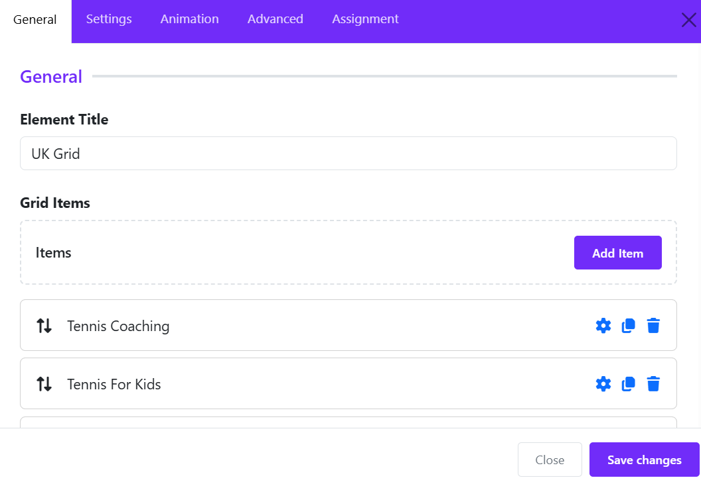
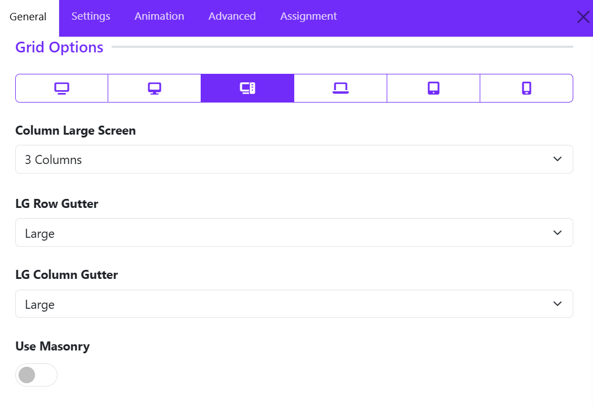
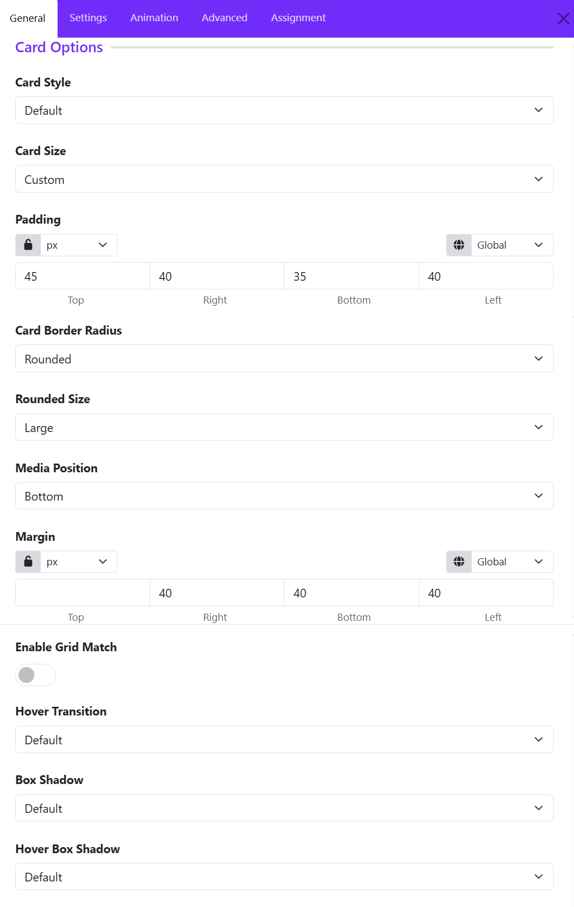
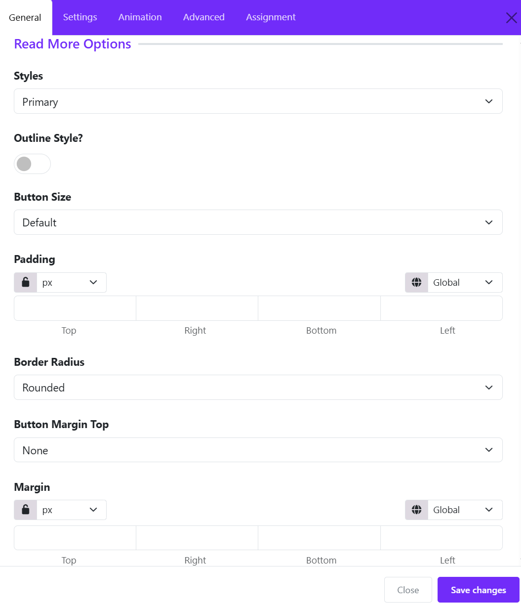

# Uk Grid 

The widget is designed to organize content into a responsive grid layout, making it ideal for portfolios, galleries, team sections, services, and feature showcases.

## General Settings

### Element Title

Enter a title for the widget. This title is used internally within the Astroid Layout Builder to help identify the widget and may also be displayed on the frontend depending on your layout configuration.

### Add Grid Item

The **Grid Items** section allows you to add individual cards or content blocks to the UK Grid widget. Each item can contain an image, title, meta text, description, and a link.

* Click **Add Item** to create a new grid item.

#### Step 1: Select the Media Type

Under **Media Type**, choose the content type for the item:

* **Image** – Display an image as the item's media.
* Other media types may be available depending on the widget version.

#### Step 2: Add an Image

1. Click **Change Image**.
2. Select an image from the Joomla Media Manager or upload a new one.
3. The selected image will be displayed in the preview area.
4. Use **Clear** to remove the current image.

#### Step 3: Enter the Title

In the **Title** field, enter the main heading for the grid item. Ex: Tennis Coaching

#### Step 4: Add Meta Information

Use the **Meta** field to display supplementary information such as:

* Item number
* Category
* Short label
* Date

#### Step 5: Add a Description

The **Description** editor allows you to enter detailed content for the item.

You can:

* Format text
* Add links
* Insert images
* Switch between **Editor** and **View Source** modes

#### Step 6: Add a Link

Enter a URL in the **Link** field if the grid item should redirect users to another page.

**Example:** https://yourwebsite.com/tennis-coaching

When visitors click the item, they will be taken to the specified page.

#### Step 7: Enable Background Image

Turn on **Enable Background Image** if you want the selected image to be used as the item's background instead of being displayed as a regular image.

This is useful for:

* Feature cards
* Service showcases
* Promotional blocks
* Full-image hover effects

#### Step 8: Save the Item

1. Click **Apply Changes** inside the Grid Item editor.
2. Repeat the process to add more grid items.
3. Once all items are added, save the UK Grid widget.

## Grid Settings

The Grid Options section controls how grid items are arranged across different screen sizes.

### Responsive Device Selector

At the top of the Grid Options panel, you can switch between different device sizes:

* **XL Desktop** – Extra large screens
* **Desktop** – Standard desktop screens
* **Large Screen (LG)** – Large laptops and monitors
* **Laptop**
* **Tablet**
* **Mobile**

Each device can have its own grid configuration to ensure optimal responsiveness.

### Column Large Screen

Determines how many grid items are displayed per row on large screens.

**Options include:**

* 1 Column
* 2 Columns
* 3 Columns
* 4 Columns
* 5 Columns
* 6 Columns

**Example:**

* **1 Column** displays grids in a single vertical list.
* **3 Columns** displays three grids side-by-side in each row.

### LG Row Gutter

Controls the **vertical spacing** between rows of grid items on large screens.

**Common options:**

* Inherit
* Collapse
* Xsmall
* Small
* Medium
* Large
* Xlarge

**Example:** "Large" creates more space between grid rows, resulting in a cleaner and more spacious layout.

### LG Column Gutter

Controls the **horizontal spacing** between grid columns.

**Common options:**

* Inherit
* Collapse
* Xsmall
* Small
* Medium
* Large
* Xlarge

**Example:** "Large" option increases the space between grid cards, improving readability and visual separation.

### Use Masonry

Enables or disables the **Masonry Layout**.

**Disabled**

* All grid items align in uniform rows.
* Suitable when grid items have similar content lengths.

**Enabled**

* Grid items are arranged in a Pinterest-style masonry grid.
* Cards with varying heights fit together naturally, minimizing empty space.
* Ideal when grid content lengths differ significantly.

**Benefits of Masonry:**

* More efficient use of available space.
* Creates a modern, dynamic layout.
* Reduces large gaps caused by grids of unequal height.

## Card Settings

The **Card Options** section controls the appearance, spacing, and behavior of grid cards. These settings allow you to customize how each grid item is displayed, ensuring a consistent and visually appealing layout.

### Card Style

Defines the overall visual style of the testimonial card. Options available:

* Default
* Primary
* Secondary
* Success
* ...  
* Custom

If you choose **Custom** style, then you can configure color, background color, and border style of grid cards.

### Card Size

Controls the internal spacing (padding) of the card.

**Available options:**

* None
* Small
* Default
* Large
* Custom

**Example:**

* **Small** creates compact grid cards.
* **Large** provides more breathing room around the content.

### Card Border Radius

Determines the shape of the card corners. Choose one of available options, if you choose **Custom**, you can adjust the border radius manually.

### Rounded Size

Available when **Card Border Radius** is set to **Rounded**.

Controls the amount of corner rounding.

**Typical options:**

* Small
* Medium
* Large

### Media Position

Controls where the media element (such as an image, icon, or video) is displayed relative to the content area of each grid item.

* Available positions: Top, Left, Bottom, Right, Inside, Cover. 

### Enable Grid Match

Ensures all grid cards within the grid have equal heights.

**Disabled**: Card heights adjust automatically based on content length.

**Enabled**: All cards in the same row maintain a consistent height, and Creates a cleaner and more uniform grid layout.

**Recommended for:**

* Grid items with varying content lengths.
* Professional and structured layouts.

### Hover Transition

Applies an animation effect when users hover over a grid card. You can choose one of options available.

Hover transitions can add interactivity and improve user engagement.

### Box Shadow

Adds a shadow effect around a grid card.

**Common options:**

* No shadow
* Small shadow
* Regular shadow
* Large shadow

**Benefits:**

* Creates depth and visual separation.
* Helps cards stand out from the background.

### Hover Box Shadow

Defines the shadow effect applied when a visitor hovers over a card.

**Example:** A card may display a subtle shadow normally and a larger shadow on hover to emphasize interactivity.

## Icon Settings

The **Icon Settings** section in the **UK Grid Widget** allows you to customize the appearance and behavior of icons displayed within each grid item. These options help you create visually appealing feature boxes, service listings, and information grids.

### Icon Size

Set the size of the icon displayed in the grid item.

* Enter a value in pixels (px) to increase or decrease the icon size.
* Larger icons create stronger visual emphasis and are ideal for feature highlights.
* Smaller icons provide a cleaner and more compact layout.
* Example: A value of **60px** displays a prominent icon suitable for service or feature sections.

### Color

Define the default icon color.

* You can choose any color that matches your website branding and design style.
* If left empty, the icon may inherit the theme's default color settings.

### Color Hover

Specify the icon color when a visitor hovers over the grid item.

### Enable Icon Link

Turn the icon itself into a clickable element.

* **Disabled**: The icon is displayed as a visual element only.
* **Enabled**: The icon becomes clickable and links to the URL defined for the grid item.
* Useful when you want users to navigate by clicking either the icon or the content area.

## Image Settings

The **Image Settings** allows you to control the appearance, size, styling, and hover behavior of images within grid items. These options help create visually appealing layouts for portfolios, services, team members, blogs, and galleries.

### Choose Layout

Select how the image is displayed within the grid item.

* Classic – Displays the image in a standard layout above or alongside the content.
* Additional layouts (if available) may provide alternative image positioning and styling options.

**Best for:** General-purpose grid layouts, service boxes, and portfolio items.

### Width

Define a custom width for the image.

* Supports different units such as **px**, **%**, **vw**, and more.
* Leave empty to use the default width.
* Responsive controls allow different widths for desktop, tablet, and mobile devices.

**Example:** Set a width of **300px** for fixed-size images or **100%** for responsive layouts.

### Height

Specify the image height.

* Supports multiple units (px, %, vh, etc.).
* Helps maintain a consistent image size across all grid items.
* Can be combined with **Image Cover** to create uniform image cards.

**Example:** Set a height of **250px** for equal-height grid images.

### Image Fullwidth

Enable this option to make the image stretch across the full width of its container.

* **Enabled:** The image occupies the entire available width.
* **Disabled:** The image retains its original or custom width.

### Enable Image Cover

Controls how images fit within the specified dimensions.

* **Enabled:** The image fills the entire container while maintaining its aspect ratio. Parts of the image may be cropped.
* **Disabled:** The full image is displayed, which may leave empty space depending on the container dimensions.

### Border Radius

Add rounded corners to images.

* Set values for: Top, Right, Bottom, Left.
* Use the **Lock** icon to apply the same radius to all corners.
* Supports various units such as px, rem, and em.

**Example:** A radius of **20px** creates smooth rounded corners.

### Hover Effect

Choose an animation effect that appears when users hover over an image.

### Hover Transition

Controls the animation style and speed of the hover effect.

* **Default** – Uses the framework's default transition timing.
* Additional options may provide faster, slower, smoother, or more dramatic animations.

## Title Settings

The **Title Settings** section allows you to customize the appearance and structure of the title displayed in each UK Grid item. These options help improve content hierarchy, typography, and spacing for a polished and professional design.

### HTML Element

Choose the HTML tag used for the grid item title.

**Available options include:**

* **H1** – Main page heading (use sparingly).
* **H2** – Major section heading.
* **H3** – Default option for most grid item titles.
* **H4 – H6** – Smaller heading levels.
* **DIV** – Generic container without semantic heading value.
* **SPAN** – Inline text element.

**Recommended:** Use **H3** for service cards, portfolio items, and feature grids.

### Font Styles

Customize the typography of the title.

This option opens Astroid's typography controls, allowing you to configure:

* Font Family
* Font Size
* Font Weight
* Text Transform
* Font Style
* Letter Spacing
* Line Height
* Text Decoration

#### Inherit

By default, the title inherits typography settings from your template or global theme styles.

#### Custom Typography

Override inherited styles to create unique title designs for specific grid sections.

**Examples:**

* Increase font size for featured content.
* Apply bold font weight for better emphasis.
* Use uppercase text for modern card layouts.

### Margin

Control the spacing around the title.

Set individual values for: Top, Right, Bottom, Left.

### Best Practices

* Use **H2** or **H3** for most grid titles to maintain proper heading hierarchy.
* Keep typography consistent across all grid items.
* Add bottom margin to create clear separation between the title and content.
* Use responsive margin settings to ensure titles remain well-spaced on mobile devices.
* Avoid using **H1** within grid items unless the title represents the primary page heading.

### Example Configuration

| Setting       | Recommended Value |
| ------------- | ----------------- |
| HTML Element  | H3                |
| Font Weight   | 600–700           |
| Font Size     | 20–28px           |
| Line Height   | 1.3–1.5           |
| Bottom Margin | 10–20px           |

These settings provide a clean, readable title style that works well for services, portfolios, team members, and feature grids created with the UK Grid widget.

## Meta Settings

The **Meta Settings** allows you to customize the appearance and placement of meta information displayed within each grid item. Meta content can include categories, dates, tags, labels, subtitles, or any secondary information associated with the grid item.

### Font Styles

Control the typography of the meta text.

This option opens Astroid's typography settings, allowing you to customize:

* Font Family
* Font Size
* Font Weight
* Font Style
* Text Transform
* Letter Spacing
* Line Height
* Text Decoration

### Background Color

Set a background color for the meta element.

### Margin

Control the outer spacing around the meta element.

You can set values independently for: Top, Right, Bottom, Left.

**Common Use:** Add bottom margin to separate the meta from the title.

### Padding

Control the inner spacing between the meta text and its container. You can configure: Top, Right, Bottom, Left.

Padding is particularly useful when using background colors to create badge-style meta elements.

### Border Radius

Add rounded corners to the meta container.

#### Available Controls

* Top
* Right
* Bottom
* Left

Use the lock option to apply the same radius to all corners.

### Meta Position

Choose where the meta information appears within the grid item.

## Content Settings

The **Content Settings** section allows you to customize the typography and appearance of the content or description text displayed within each UK Grid item.

This option opens Astroid's typography settings, allowing you to customize:

* Font Family
* Font Size
* Font Weight
* Font Style
* Text Transform
* Letter Spacing
* Line Height
* Text Decoration

## Read More Settings

The **Read More Options** allow you to customize the appearance and behavior of the call-to-action button displayed on each slide.

### Styles

Choose a predefined button style for the Read More button.

**Available options may include:**

* Primary
* Secondary
* Default
* Danger
* Text
* ...  
* Link

### Outline Style

Enable **Outline Style** to display the button with an outlined border instead of a solid background.

* Disabled: The button displays a solid background color.
* Enabled: The button may display with transparent background, colored border, and colored text.

This option is useful for creating a cleaner and more minimal design.

### Button Size

Select the size of the Read More button. Larger buttons improve visibility, while smaller buttons create a more compact layout.

**Common options include:**

* Small
* Default
* Large

### Padding

Adjust the internal spacing of the button.

**Settings:**

* Top
* Right
* Bottom
* Left

Additional controls include:

* **Unit Selection** (px, em, rem, %, etc.)
* **Responsive Control** for different devices
* **Lock/Unlock Values** to keep all sides synchronized

### Border Radius

Control the shape of the button corners.

**Common options:**

* None (square corners)
* Rounded
* Pill
* Custom

Use higher radius values to create softer, more modern-looking buttons.

### Button Margin Top

Add vertical spacing above the Read More button.

This setting is useful when:

* The button appears too close to the content above it.
* You want better separation between the content and the call-to-action.

### Margin

Control the external spacing around the entire button. Margins help position the button correctly within the grid item and improve overall layout balance.

**Available controls:** Top, Right, Bottom, Top.

