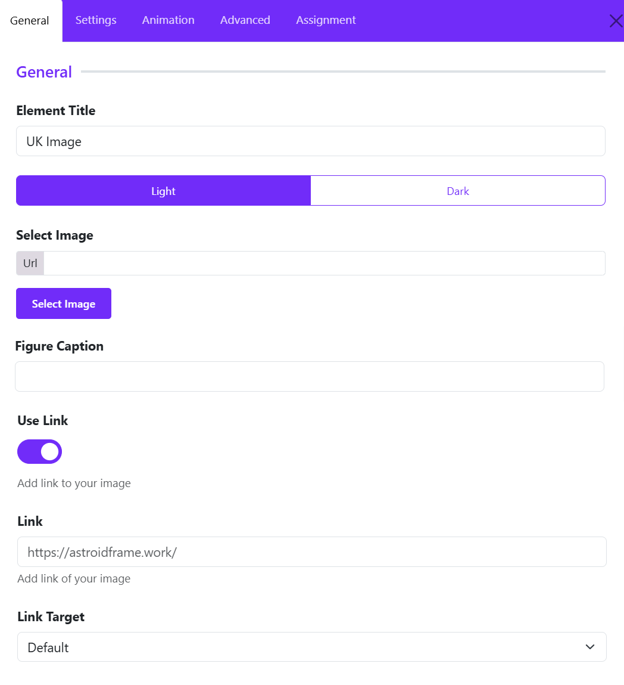
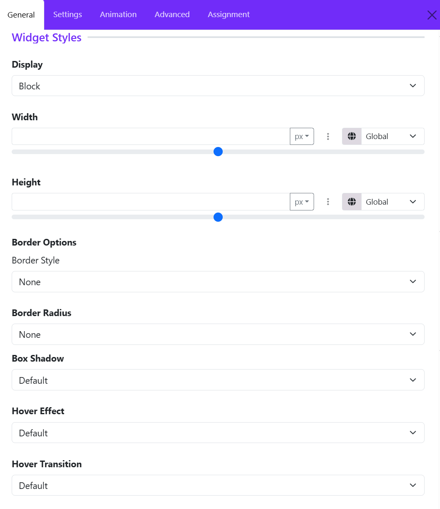
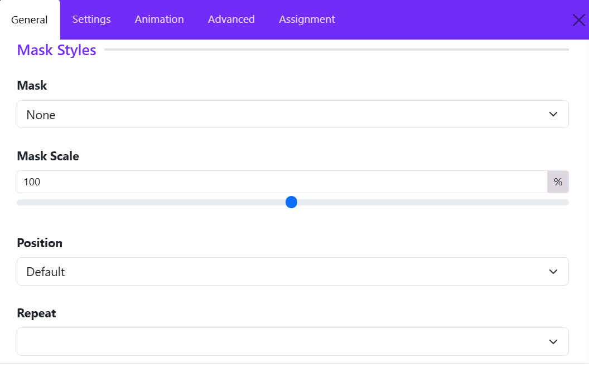

# UK Image Widget

The **UK Image** widget allows you to display images with optional captions and clickable links. It is ideal for showcasing photos, banners, featured content, and visual highlights throughout your website.

## General Settings



### Element Title

The **Element Title** helps you identify the widget within the Astroid Layout Builder.

1. Enter a descriptive name for the image widget.
2. The title is used for administrative purposes and helps organize your layout structure.

```
Hero Banner Image
```

**Tip:** Use meaningful titles when working with multiple image widgets to make future edits easier.

### Select Image

The **Select Image** option allows you to choose the image that will be displayed on the frontend.

1. Click **Select Image** or **Change Image**.
2. Browse the Joomla Media Manager.
3. Upload a new image or select an existing one.
4. Save your selection.

**Best Practices**

* Use high-quality images for professional results.
* Optimize image sizes to improve page loading speed.
* Use appropriate image dimensions for your design layout.

### Figure Caption

The **Figure Caption** field allows you to add descriptive text below the image.

1. Enter a short caption describing the image.
2. The caption will appear beneath the image on the frontend.

**Example**: Professional Tennis Coaching Sessions

#### Benefits

* Provides additional context for visitors.
* Improves content accessibility.
* Enhances image presentation and storytelling.

**Tip:** Keep captions concise and informative.

### Use Link

The **Use Link** toggle determines whether the image should become clickable.

* Disabled: The image is displayed only as a visual element. 
* Enabled: The image becomes a clickable link.              

#### When to Enable

* Linking to service pages
* Directing visitors to products
* Opening portfolio projects
* Promoting special offers or campaigns

### Link

The **Link** field specifies the destination URL when users click the image.

1. Enable **Use Link**.
2. Enter the desired URL.

### Link Target

The **Link Target** setting controls how the linked page opens when the image is clicked.

- Default
- New Window
- Parent Frame
- Full body of the new window

## Widget Styles Settings



The **Widget Styles** section allows you to customize the appearance, size, borders, and hover effects of the UK Image Widget. These settings help you control how the image is displayed and how users interact with it. ([Astroid Framework][1])

### Display

**Display** determines how the image widget behaves within the page layout.

* **Block** – Displays the image on its own line and takes the available width.
* **Block Inline** -   
* **Inline** – Allows the image to sit alongside other elements.
* **Flex** – Uses flexible layout behavior for advanced positioning.
* **Inline Flex** -

### Width

The **Width** setting controls the horizontal size of the image widget.

* Define a custom width value.
* Choose measurement units such as: px and %
* Responsive controls allow different widths for desktop, tablet, and mobile devices.

**Common Uses**

* Set a fixed width (e.g., 300px) for logos.
* Use 100% width to make images span the entire container.
* Use percentage values for responsive layouts.

### Height

The **Height** option controls the vertical size of the image widget.

#### Features

* Specify a custom height value.
* Select measurement units such as pixels or percentages.
* Configure responsive heights for different screen sizes.

#### Common Uses

* Create consistent image dimensions across a gallery.
* Set banner images to a fixed height.
* Maintain proportional layouts across devices.

### Border Style

Choose the style of border applied around the image.

* **None** – No border is displayed.
* **Solid** – Continuous border line.
* **Dashed** – Border made of dashes.
* **Dotted** – Border made of dots.
* **Double** – Two border lines.

### Border Radius

The **Border Radius** setting controls the roundness of the image corners.

Available Styles:

* **None** – Sharp corners.
* **Rounded** – Soft rounded corners.
* **Circle** – Creates a circular image when width and height are equal.
* **Pill** – Highly rounded edges.

Examples:

* Use **Circle** for team member avatars.
* Use **Rounded** for modern card layouts.
* Use **Pill** for creative gallery designs.

### Box Shadow

The **Box Shadow** option adds depth and visual emphasis to the image.

#### Benefits

* Creates a floating effect.
* Helps images stand out from the background.
* Enhances modern UI designs.

#### Typical Choices

* **No shadow** – No shadow.
* **Small Shadow** – Subtle depth.
* **Medium Shadow** – Balanced emphasis.
* **Large Shadow** – Strong visual focus.

#### Recommended Usage

Use light shadows for professional websites and stronger shadows for promotional or featured content.

### Hover Effects

Hover effects add interactive animations when visitors move their mouse over the image.

Choose a visual effect that is triggered on hover.

### Hover Transition

The **Hover Transition** setting controls how the hover animation is performed. Choose one of transition options from the drop-down list. 

## Mask Styles Settings



The **Mask Styles** section allows you to apply decorative shape masks to your image, creating unique and visually appealing designs without editing the image itself.

### Mask

**Purpose:** Select a mask style for the image. You can use masks to make featured images stand out or to match your website's design style.

* **None** 
* **Style 1** 
* **Custom**

### Mask Scale

**Purpose:** Adjust the size of the selected mask.

* **100%** – Default mask size.
* **Lower values** – Make the mask smaller.
* **Higher values** – Enlarge the mask.

**Example:**
If parts of the image are hidden by the mask, increase the scale to show more of the image within the mask area.

### Position

**Purpose:** Control where the mask is placed on the image. You can choose one of options available.

### Repeat

**Purpose:** Define whether the mask pattern repeats across the image.

Repeat options available: 

* **No Repeat** – Display the mask only once.
* **Repeat All** – Repeat the mask horizontally and vertically.
* **Repeat X** – Repeat horizontally only.
* **Repeat Y** – Repeat vertically only.

**Example:**
Use repeating masks to create patterned backgrounds or decorative image effects.

**Tip:**
For most standard image displays, **No Repeat** provides the cleanest result.


