# UK Testimonials

## General Settings

The **General** tab is where you configure the content of the UK Testimonials widget and add testimonial entries that will be displayed on your website. This section allows you to define the widget title, manage testimonial items, and control the overlay text color.

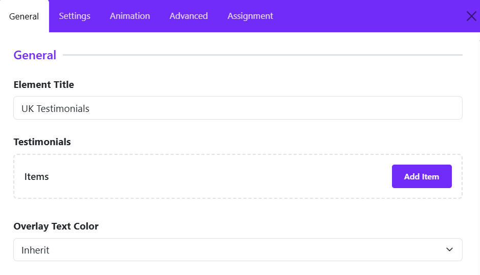

### Element Title

Enter a title for the widget. This title is used internally within the Astroid Layout Builder to help identify the widget and may also be displayed on the frontend depending on your layout configuration.

**Example:**
`UK Testimonials`

### Testimonials Items

This section contains all testimonial items that will be displayed by the widget.

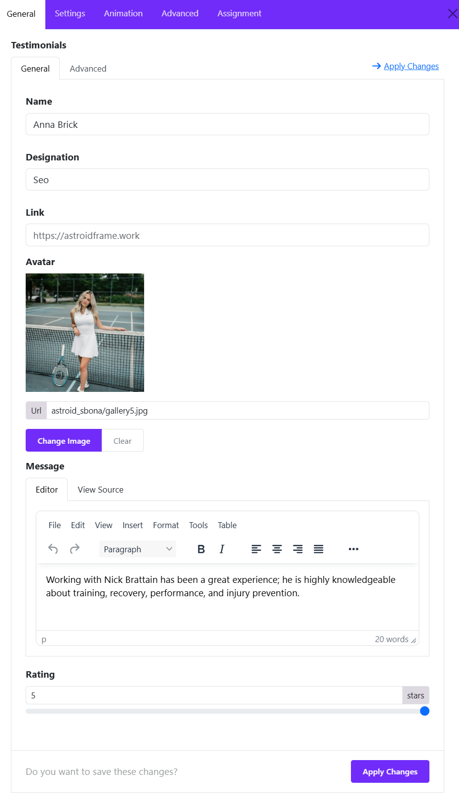

Click **Add Item** to create a new testimonial entry. Each testimonial item typically includes:

* **Name** – The testimonial author's name.
* **Designation** – Job title, position, or company name.
* **Link** (optional) – URL associated with the testimonial.
* **Avatar** – Profile image of the testimonial author.
* **Message** – The testimonial or review content.
* **Rating** – allows you to display a star rating for each testimonial, helping visitors quickly understand the customer's level of satisfaction.

You can add multiple testimonials and reorder them as needed to create a dynamic testimonial showcase.

### Overlay Text Color

Defines the text color used within testimonial overlays.

**Options:**

* **Inherit** – Uses the color inherited from the parent container or template style.
* **Light** – Optimized for dark backgrounds or image overlays.
* **Dark** – Suitable for light backgrounds.

Choosing the correct overlay text color ensures optimal readability and visual consistency across your testimonial section.

## Grid Settings

The Grid Options section controls how testimonial items are arranged across different screen sizes. Astroid provides responsive settings, allowing you to define the number of columns, spacing between items, and masonry behavior for each device breakpoint.

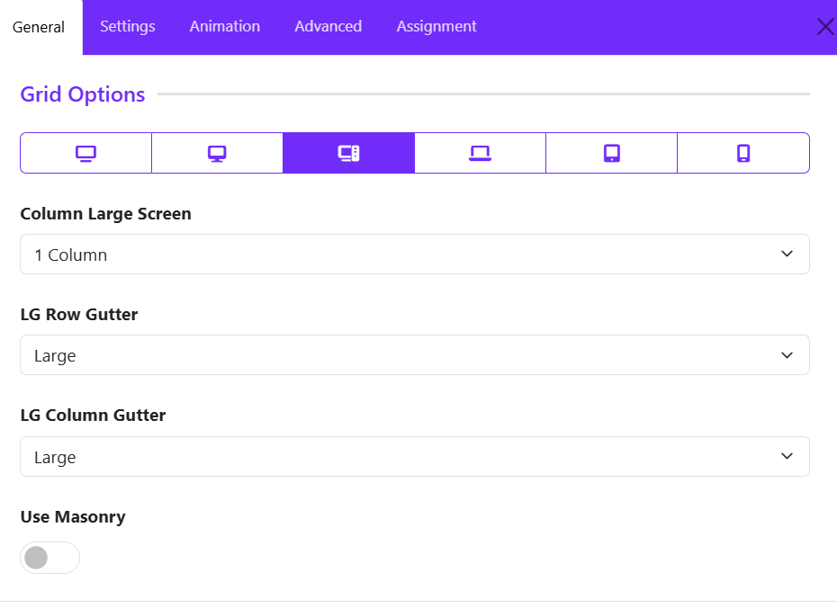

### Responsive Device Selector

At the top of the Grid Options panel, you can switch between different device sizes:

* **XL Desktop** – Extra large screens
* **Desktop** – Standard desktop screens
* **Large Screen (LG)** – Large laptops and monitors
* **Laptop**
* **Tablet**
* **Mobile**

Each device can have its own grid configuration to ensure optimal responsiveness.

### Column Large Screen

Determines how many testimonial items are displayed per row on large screens.

**Options typically include:**

* 1 Column
* 2 Columns
* 3 Columns
* 4 Columns
* 5 Columns
* 6 Columns

**Example:**

* **1 Column** displays testimonials in a single vertical list.
* **3 Columns** displays three testimonials side-by-side in each row.

### LG Row Gutter

Controls the **vertical spacing** between rows of testimonials on large screens.

**Common options:**

* Inherit
* Collapse
* Xsmall  
* Small
* Medium
* Large
* Xlarge

**Example:** "Large" creates more space between testimonial rows, resulting in a cleaner and more spacious layout.

### LG Column Gutter

Controls the **horizontal spacing** between testimonial columns.

**Common options:**

* Inherit
* Collapse
* Xsmall
* Small
* Medium
* Large
* Xlarge

**Example:** "Large" option increases the space between testimonial cards, improving readability and visual separation.

### Use Masonry

Enables or disables the **Masonry Layout**.

**Disabled**

* All testimonial items align in uniform rows.
* Suitable when testimonials have similar content lengths.

**Enabled**

* Testimonials are arranged in a Pinterest-style masonry grid.
* Cards with varying heights fit together naturally, minimizing empty space.
* Ideal when testimonial content lengths differ significantly.

**Benefits of Masonry:**

* More efficient use of available space.
* Creates a modern, dynamic layout.
* Reduces large gaps caused by testimonials of unequal height.

## Card Settings

The **Card Options** section controls the appearance, spacing, and behavior of testimonial cards. These settings allow you to customize how each testimonial is displayed, ensuring a consistent and visually appealing layout.

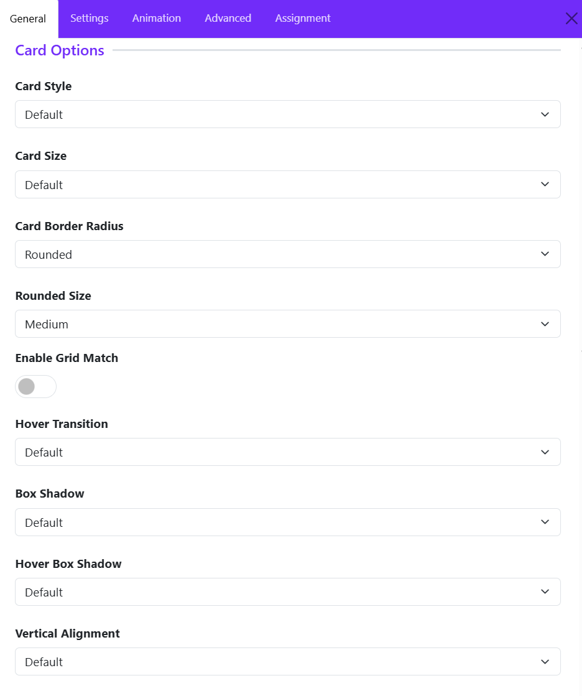

### Card Style

Defines the overall visual style of the testimonial card. Options available: 

* Default
* Primary
* Secondary
* Custom

If you choose **Custom** style, then you can configure color, background color, and border style of testimonial cards. 

### Card Size

Controls the internal spacing (padding) of the card.

**Common options:**

* None
* Small
* Default
* Large
* Custom

**Example:**

* **Small** creates compact testimonial cards.
* **Large** provides more breathing room around the content.

### Card Border Radius

Determines the shape of the card corners. Choose one of available options, if you choose **Custom**, you can adjust the border radius manually. 

### Rounded Size

Available when **Card Border Radius** is set to **Rounded**.

Controls the amount of corner rounding.

**Typical options:**

* Small
* Medium
* Large

### Enable Grid Match

Ensures all testimonial cards within the grid have equal heights.

**Disabled**: Card heights adjust automatically based on content length.

**Enabled**: All cards in the same row maintain a consistent height, and Creates a cleaner and more uniform grid layout.

**Recommended for:**

* Testimonial grids with varying content lengths.
* Professional and structured layouts.

### Hover Transition

Applies an animation effect when users hover over a testimonial card. You can choose one of options available. 

Hover transitions can add interactivity and improve user engagement.

### Box Shadow

Adds a shadow effect around the testimonial card.

**Common options:** 

* No shadow
* Small shadow
* Regular shadow
* Large shadow

**Benefits:**

* Creates depth and visual separation.
* Helps cards stand out from the background.

### Hover Box Shadow

Defines the shadow effect applied when a visitor hovers over a card.

**Example:** A card may display a subtle shadow normally and a larger shadow on hover to emphasize interactivity.

### Vertical Alignment

Controls how card content is aligned vertically when cards have equal heights.

**Common options:**

* Default: aligns all testimonial content at the top of the card.
* Center: centers content vertically.
* Bottom: aligns content to the bottom of the card.

## Slide Settings

The **Slider Options** section allows you to display testimonial cards, creating an interactive carousel that users can navigate horizontally. These settings control the slider behavior, navigation appearance, spacing, and styling.

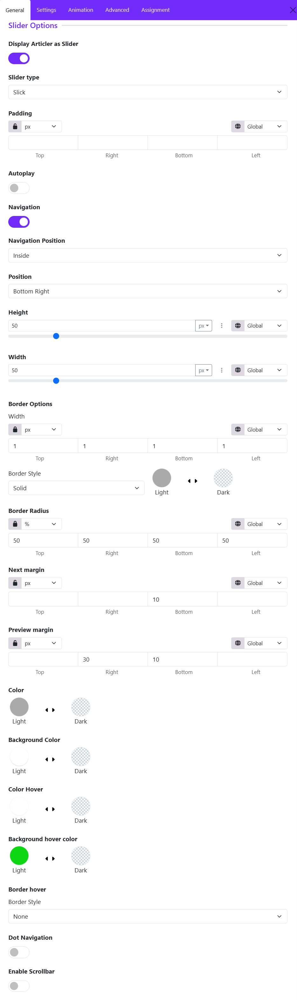

### Display Article as Slider

* **Enabled**: Testimonials appear in a carousel/slider layout.
* **Disabled**: Testimonials are displayed using the configured grid layout.

### Slider Type

Select the sliding animation style available from the drop-down list.

* Slick
* Swiper

### Padding

Adds internal spacing around the entire slider area.

**Features:**

* Individual values for **Top**, **Right**, **Bottom**, and **Left**
* Multiple units supported (px, em, rem, %, etc.)
* Responsive controls available for different screen sizes

### Autoplay

Automatically advances testimonials without user interaction.

* Disabled: Users manually navigate through testimonials.

* Enabled: Testimonials rotate automatically at predefined intervals.

Ideal for homepage testimonial sections where continuous content rotation is desired.

### Navigation

Shows or hides the Previous/Next navigation controls.

* Enabled: Displays navigation arrows.
* Disabled: Hides navigation arrows.

### Navigation Position

Determines where the navigation controls appear. **Inside** or **Outside**

* Inside: Arrows appear within the slider container.
* Outside: Arrows appear outside the slider boundaries.

### Position

Controls the exact placement of navigation buttons. Choose a suitable position:

* Top Left
* Top Center
* Top Right
* Center Left
* Center Right
* Bottom Left
* Bottom Center
* Bottom Right

### Navigation Height

Defines the height of navigation buttons. Larger values create larger navigation buttons.

**Features:**

* Adjustable slider control
* Multiple unit types
* Responsive support

### Navigation Width

Defines the width of navigation buttons. Can be adjusted independently from height to create square, rectangular, or circular controls.

### Border Width

Sets the thickness of the navigation button border. You can define separate values for:

* Top
* Right
* Bottom
* Left

### Border Style

Defines the border appearance. Choose a border style. 

**Common options:**

* None
* Solid
* Dashed
* Dotted
* Double

### Border Radius

Controls the roundness of navigation buttons.

### Examples

* **0%** = Square corners
* **10–20%** = Slight rounding
* **50%** = Perfect circle (when width and height are equal)

### Navigation Next Margin

Adds spacing around the **Next** button. This is useful when positioning navigation controls close together.

### Navigation Previous Margin

Adds spacing around the **Previous** button. Allows independent adjustment of spacing for better alignment.

### Color

Sets the icon color of navigation arrows.

### Background Color

Defines the default background color of navigation buttons.

### Color Hover

Sets the arrow icon color when a visitor hovers over the navigation button.

### Background Hover Color

Defines the button background color on hover. Commonly used to highlight navigation controls when users interact with them.

### Border hover

Defines how the navigation button border behaves on hover. Useful for creating advanced hover effects.

### Dot Navigation

Displays pagination dots below or within the slider. Best for sliders containing multiple testimonials.

* Enabled: Users can navigate directly to specific testimonial slides.
* Disabled: Only arrow navigation is available.

### Enable Scrollbar

Displays a draggable scrollbar beneath the slider. Useful when displaying a large number of testimonials.

* Enabled: Users can drag the scrollbar to browse testimonials.
* Disabled: Navigation relies on arrows, dots, touch gestures, or mouse dragging.

## Avatar Settings

The **Avatar Settings** section allows you to control the appearance and positioning of testimonial author images (avatars). These options help you create a visually appealing testimonial layout that matches your website design.

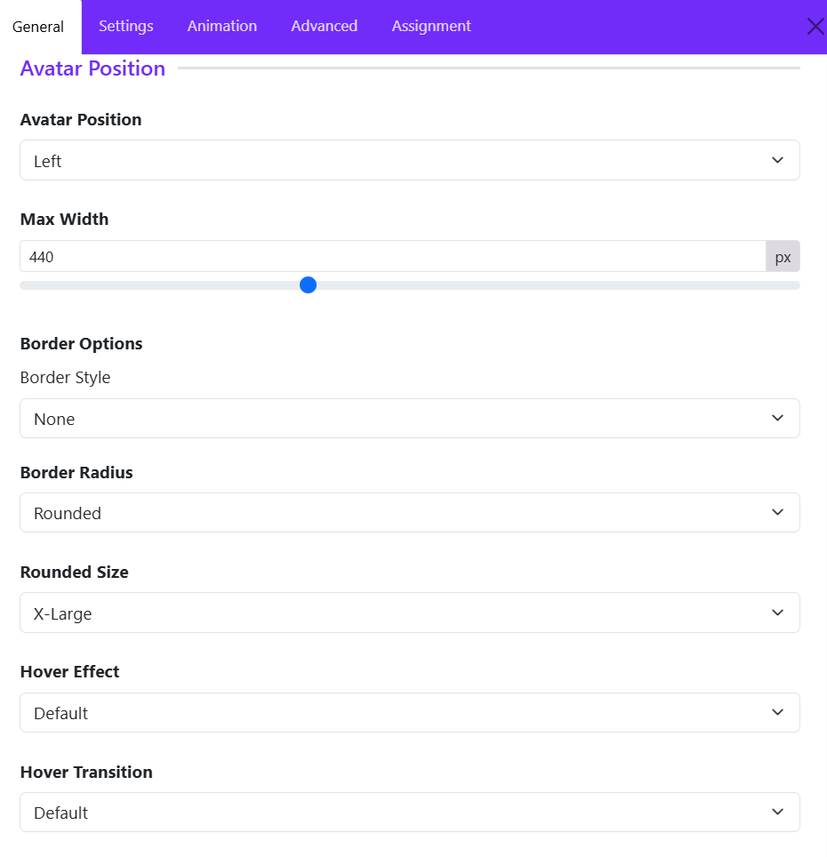

### Avatar Position

Choose where the avatar image appears relative to the testimonial content.

* **Left** – Displays the avatar on the left side of the testimonial.
* **Right** – Displays the avatar on the right side.
* **Top** – Places the avatar above the testimonial content.
* **Bottom** – Places the avatar below the content.

### Max Width

Defines the maximum width of the avatar image in pixels.

* Larger values create more prominent author images.
* Smaller values keep the focus on the testimonial text.

Example: `440px` allows the avatar to display at a larger size while maintaining responsiveness.

### Border Style

Select the border style to apply around the avatar:

* None
* Solid
* Dashed
* Dotted
* Double

Depending on the selected style, additional border settings such as width and color may become available.

### Border Radius

Controls the shape of the avatar corners. Options typically include:

* Rounded
* Square  
* Circle
* Pill

Rounded corners help create a softer and more modern appearance.

### Rounded Size

Available when **Rounded** is selected as the Border Radius.

Choose the intensity of the corner rounding:

* Small
* Medium
* Large
* X-Large

Larger values create smoother, more rounded corners.

### Hover Effect

Adds an animation or visual effect when visitors hover over the avatar. Hover effects can make testimonials feel more interactive and engaging.

### Hover Transition

Controls how the hover effect animates. A smoother transition creates a more polished user experience.

## Name Settings

The **Name Settings** section allows you to customize how the testimonial author's name is displayed. These options help you control the heading structure, typography, and spacing of the name element.

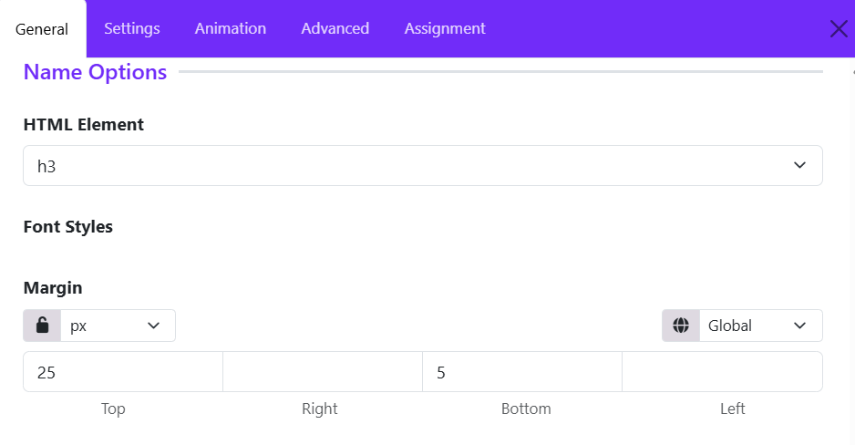

### HTML Element

Select the HTML tag used for the testimonial author's name.

Available options typically include:

* **H1 – H6** – Display the name as a heading with varying levels of importance.
* **Div** – Uses a generic block-level element.

**Example:** Selecting **H3** displays the author name using an `<h3>` tag, providing good visual emphasis while maintaining proper content hierarchy.

### Font Styles

Configure the typography of the author name.

* Font Size
* Font Weight
* Font Style
* Text Transform (Uppercase, Capitalize, Lowercase)
* Line Height
* Letter Spacing
* Text Color

Use these settings to ensure the author name stands out appropriately within the testimonial card.

### Margin

Controls the spacing around the author name element.

**Settings include:**

* **Unit Selector** – Choose the measurement unit (px, em, rem, %, etc.).
* **Responsive Control** – Apply different margins for various screen sizes.
* **Linked Values** – Lock all sides together for uniform spacing.
* **Individual Values** – Set separate margins for: Top, Right, Bottom, Left.

## Designation Settings

The **Designation Settings** section controls the appearance and placement of the testimonial author's designation, such as their job title, role, company position, or professional description.

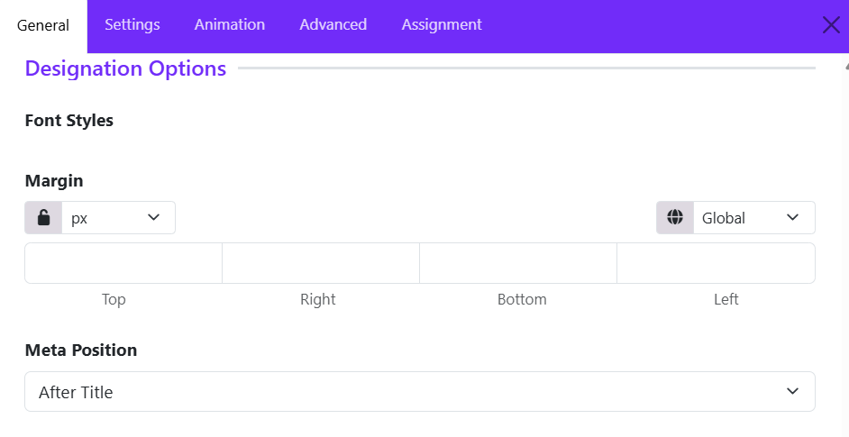

### Font Styles

Customize the typography of the designation text.

* **Font Family** – Select the typeface used for the designation.
* **Font Size** – Adjust the text size.
* **Font Weight** – Choose from Light, Regular, Medium, Bold, etc.
* **Font Style** – Normal, Italic, or Oblique.
* **Text Transform** – Uppercase, Lowercase, Capitalize, or None.
* **Line Height** – Control vertical spacing between lines.
* **Letter Spacing** – Adjust spacing between characters.
* **Text Color** – Set the color of the designation text.

### Margin

Define the spacing around the designation element.

* **Unit Selection** – Choose measurement units such as px, em, rem, or %.
* **Linked Values** – Apply the same margin to all sides.
* **Individual Values** – Set separate margins for: Top, Right, Bottom, Left.
* **Responsive Controls** – Configure different margins for desktop, tablet, and mobile devices.

### Meta Position

Determines where the designation appears in relation to the testimonial author's name.

* **Before Title** – Displays the designation above the author's name.
* **After Title** – Displays the designation below the author's name.
* **Top** – Places the designation at the top of the testimonial content area.
* **Bottom** – Places the designation below all author information.

## Message Settings

The **Message Settings** section controls the appearance and spacing of the testimonial content itself. These options allow you to customize how the testimonial text is displayed within the widget.

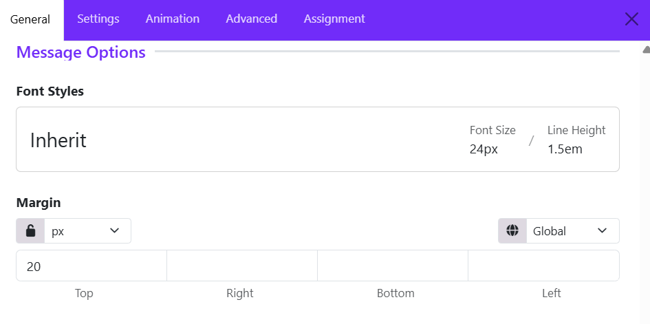

### Font Styles

Customize the typography of the testimonial message.

Available font styling options may include:

* **Font Family** – Select the typeface used for the testimonial text.
* **Font Size** – Adjust the size of the message text.
* **Font Weight** – Set the text thickness (Light, Regular, Medium, Bold, etc.).
* **Font Style** – Choose between Normal, Italic, or Oblique.
* **Line Height** – Control the vertical spacing between lines of text.
* **Letter Spacing** – Adjust the spacing between characters.
* **Text Transform** – Apply Uppercase, Lowercase, Capitalize, or None.
* **Text Color** – Define the color of the testimonial content.

The **Inherit** option uses typography settings inherited from the theme or parent container, helping maintain design consistency across the website.

### Margin

Control the spacing around the testimonial message block.

* **Unit Selector** – Choose units such as px, em, rem, %, etc.
* **Linked Values** – Apply the same margin value to all sides.
* **Individual Side Controls** – Configure: Top, Right, Bottom, Left.
* **Responsive Settings** – Adjust margins separately for desktop, tablet, and mobile devices.

## Rating Settings

The **Rating Settings** section allows you to display star ratings alongside testimonials, helping visitors quickly understand customer satisfaction and feedback quality.

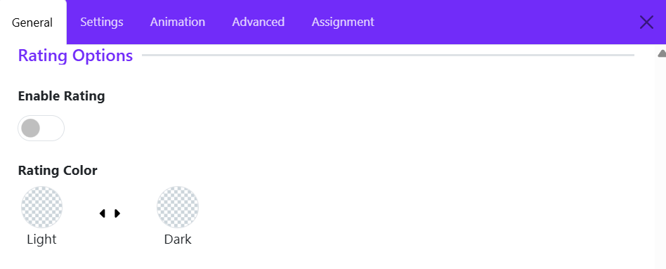

### Enable Rating

Use this toggle to show or hide the rating display within testimonial items.

* **Enabled** – Displays the rating stars for each testimonial.
* **Disabled** – Hides the rating stars from the testimonial layout.

When enabled, the widget will display the rating value assigned to each testimonial item, typically using star icons.

**Use Cases:**

* Customer reviews
* Product testimonials
* Service feedback
* Business ratings

### Rating Color

Choose the color style used for the rating stars.

### Tips

* Enable ratings when testimonials are intended to function as reviews or customer feedback.
* Match the rating color with your site's overall color scheme for better visual consistency.
* If your testimonials focus on personal endorsements rather than review scores, you may choose to disable ratings for a cleaner presentation.

The Rating Settings provide a simple way to add credibility and visual impact to testimonials by displaying customer satisfaction scores directly within the UK Testimonial widget.

## Icon Settings

The **Icon Settings** section allows you to customize the decorative icon displayed within the testimonial. Icons are commonly used to represent quotation marks, review symbols, or other visual elements that enhance the testimonial's appearance.

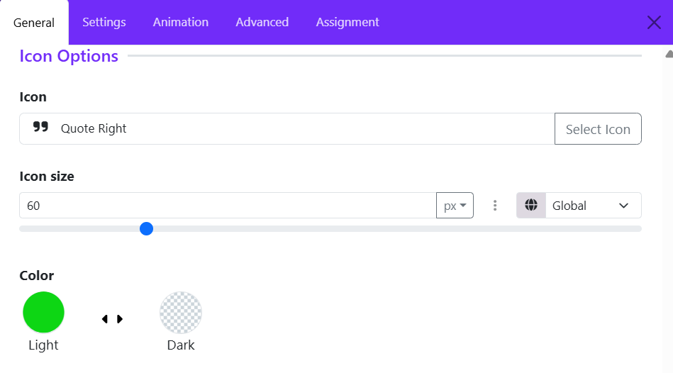

### Select Icon

Choose the icon to display in the testimonial.

### Icon Size

Controls the size of the displayed icon.

### Color

Defines the color of the icon.

