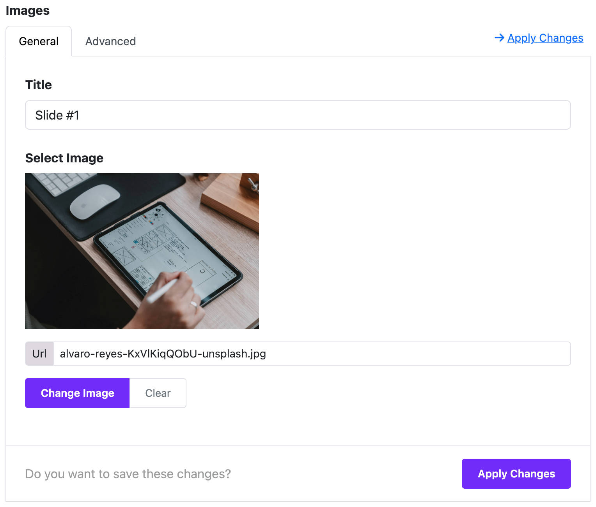

# Image Motion Cursor

The **Image Motion Cursor** widget allows you to display images that move subtly when users hover their mouse over them. It adds a modern, interactive visual effect to your Joomla site.

:::info[Pro Feature]
This widget is available in the **Astroid Pro** version only. If you are using the free version, consider [upgrading to access this feature](https://astroidframe.work/pricing).
:::

---

## 📍 Where to Find It

To add the **Image Motion Cursor Widget**:

### 📍 Step 1: Open the Layout Builder

1. Go to your Joomla **Administrator Panel**
2. Navigate to: `System` → `Site Template Styles` → Click on your **Astroid template**
3. Click the **“Template Options”** button
4. Open the **Layout** tab
5. Launch the **Layout Builder**

---

### 🧱 Step 2: Add the Widget
1. Open the **Astroid Layout Builder**.
2. Add a new **Widget** to your desired section.
3. Select **Image Motion Cursor Widget** from the widget list.


---

## ⚙️ Configuration Options

### 1. **Images**
You can add multiple images, each with optional settings:

- **Title** – A title displayed with the image (optional).
- **Image** – Select an image from your Joomla media library.

You can add as many images as you need using the **+ Add** button.



---

### 2. **Exclude Motion Effect**
- A **textarea** input where you list CSS classes of elements you want to exclude from the hover effect.
- Use commas to separate multiple class names.  
  **Example:**
  ```
  astroid-sidebar-menu,astroid-nav
  ```

This is useful when you want specific components or sections to remain static.

---

### 3. **Display Styling (Widget Styles)**

| Option                  | Description                                        | Default |
|------------------------|----------------------------------------------------|---------|
| **Image Width**        | Sets the width of each image in pixels.           | `190px` |
| **Aspect Ratio**       | Sets the width-to-height ratio for the image.     | `1.1`   |
| **Border Radius**      | Rounds the corners of the image in pixels.         | `7px`   |

These settings let you control how the image looks and behaves visually.

---

### 4. **Assignment Settings**
Control where the widget appears:

- **Show on all pages**
- **Show on no pages**
- **Show on selected pages** (you’ll be able to select menu items)

---

## 💡 Tips for Best Use

- Use high-quality images with similar dimensions for a cleaner appearance.
- Avoid adding too many images if used on the homepage to keep performance optimized.
- Combine this widget with scroll animations or parallax backgrounds for advanced effects.

---

## ✅ Summary

The **Image Motion Cursor Widget** is a stylish, interactive component that enhances the visual engagement of your Joomla website. It’s easy to use and doesn’t require coding knowledge, making it perfect for both beginners and experienced developers using the Astroid Framework.