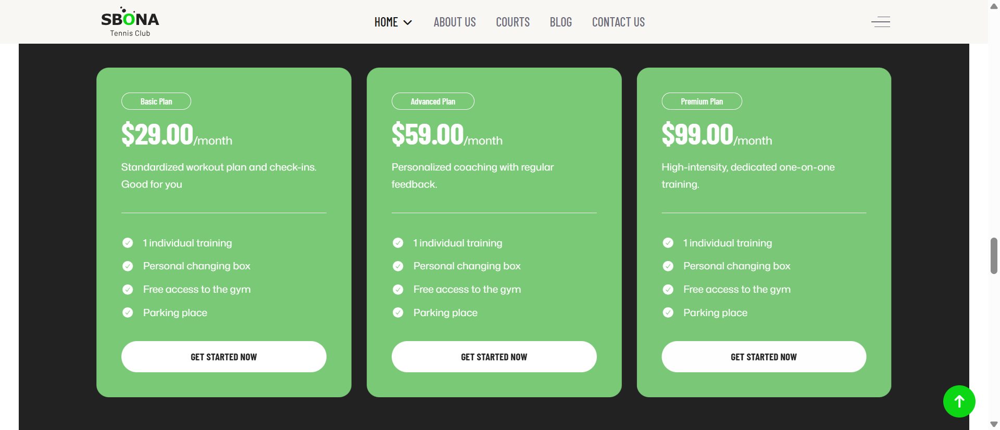
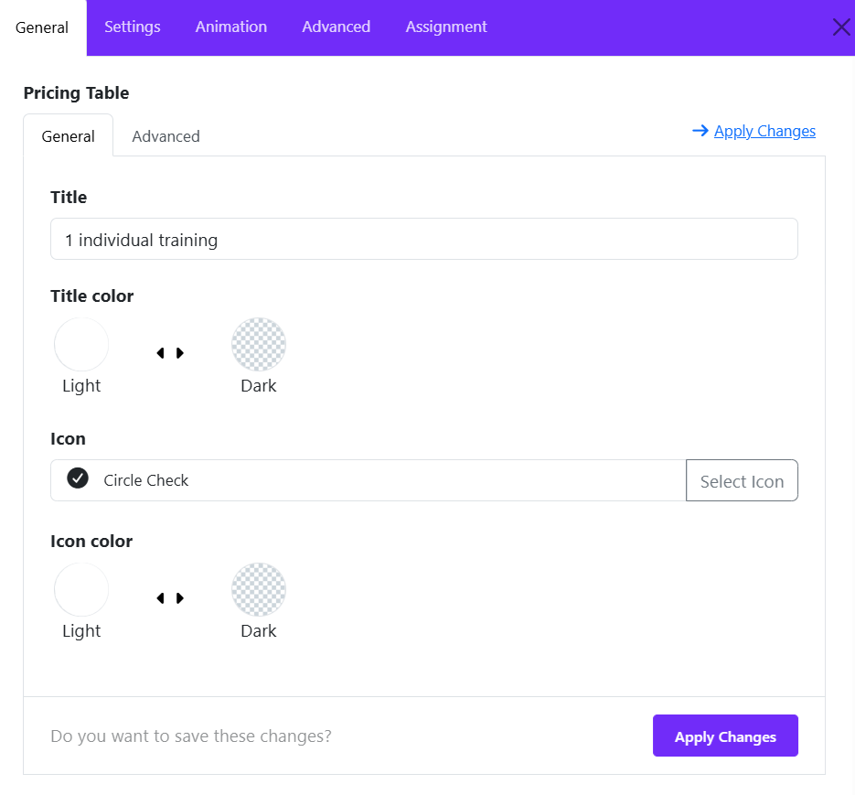
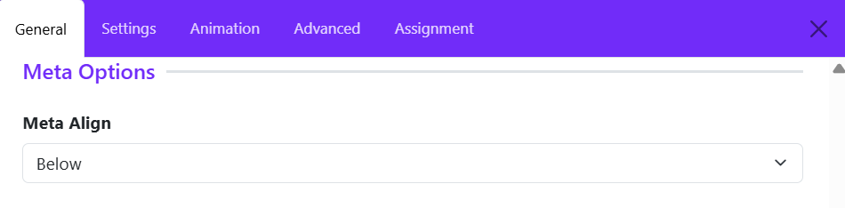
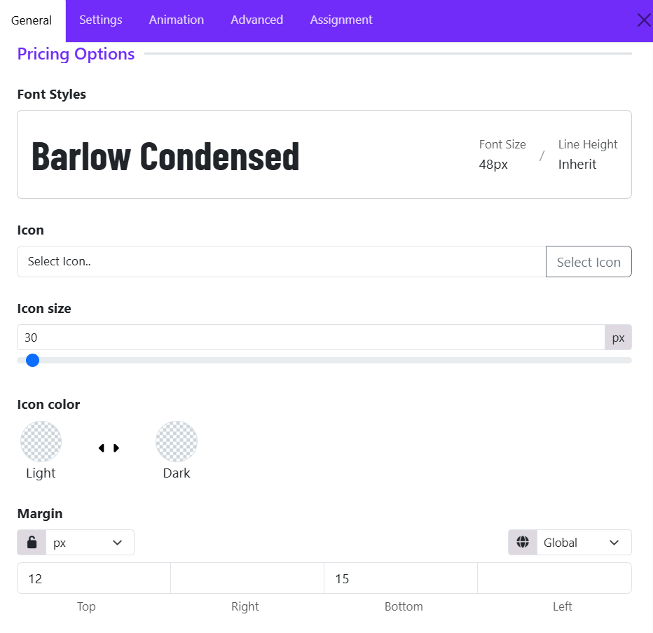
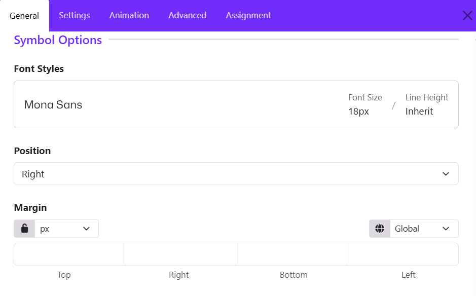
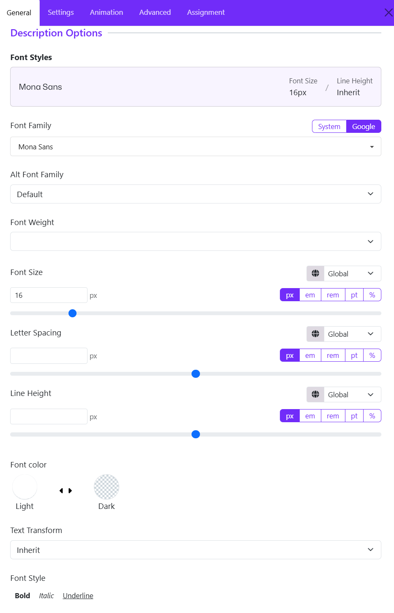
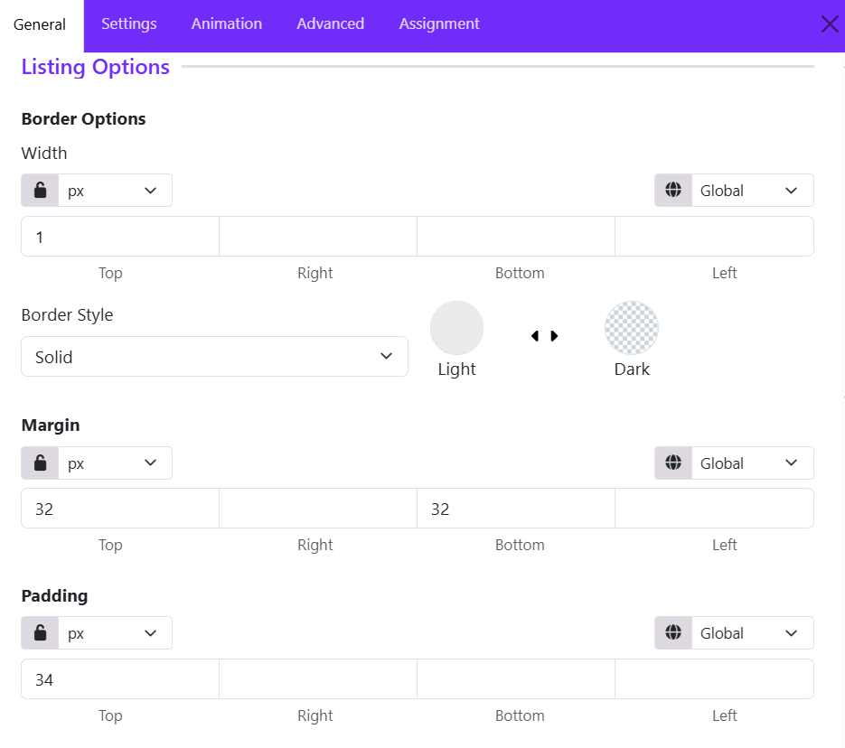
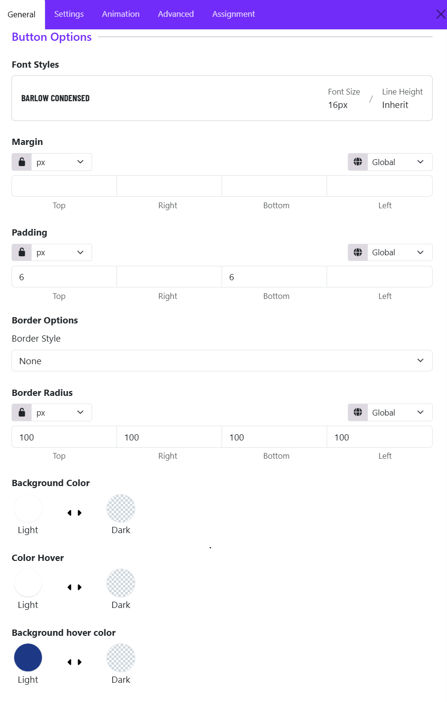

# Pricing Table

## 1. General Heading

The **General Settings** allow you to create and customize a complete pricing plan card, including plan information, pricing details, feature lists, and call-to-action buttons.

### Heading

Enter the main title of the pricing plan.

**Example:**

* Basic Plan
* Premium Plan
* Enterprise Package

This heading appears prominently at the top of the pricing table and helps visitors quickly identify the plan.

### Meta

Add a short subtitle or additional information below the heading.

**Examples:**

* Most Popular
* Best for Startups
* Recommended Choice

This field is useful for highlighting plan categories or promotional notes.

### Description

Use the built-in editor to add detailed information about the pricing plan. The description helps explain the benefits and purpose of the plan.

You can:

* Add formatted text
* Create paragraphs
* Insert lists
* Apply basic styling such as bold or italic text

**Example:**

> Standardized workout plan and weekly check-ins. Good for beginners who want a structured fitness journey.

### Price

Specify the cost of the plan.

**Example:**

* $29.00
* $99.00
* 199

This value is displayed as the primary pricing amount.

### Price Symbol

Add a pricing suffix or billing period.

**Examples:**

* /month
* /year
* Per User
* One Time

Combined with the Price field, it creates pricing formats such as:

* $29.00/month
* $199/year
* $49 One Time

### Highlight

Enter a label or badge text to emphasize a plan.

**Examples:**

* Popular
* Best Value
* Recommended
* Featured

This is commonly used to draw attention to the most attractive pricing option.

---

### Pricing Table Items

This section allows you to create the list of features included in the plan.

#### Add Item

Click **Add Item** to create a new feature.

#### Title

Enter the name of the pricing plan or package. The title is displayed prominently at the top of the pricing table item.

**Example:**

* Basic Plan
* Premium Package
* 1 Individual Training

#### Title Color

Choose the color scheme for the title. Select the option that provides the best contrast and readability for your design.

#### Icon

Add an icon to visually represent the pricing package. Click **Select Icon** to open the icon library and choose an appropriate icon.

#### Icon Color

Define the color style of the selected icon.

#### Apply Changes

After modifying any settings, click **Apply Changes** to save the item configuration and update the pricing table.

---

### Link

Enter the destination URL for the pricing table button. When users click the button, they will be redirected to this link.

### Link Text

Define the text displayed on the call-to-action button. This button encourages visitors to take action.

**Examples:**

* Buy Now
* Sign Up
* Choose Plan

### Link Target

Choose how the link opens.

* **Same Window** – Opens in the current browser tab.
* **New Window** – Opens in a new browser tab or window.

Use **New Window** when linking to external pages or third-party services.

## 2. Title Settings

The **Title Settings** allow you to customize the appearance and spacing of the pricing table title. These options help you control typography, alignment, spacing, and border styling to match your website's design.

### Font Styles

The **Font Styles** option lets you configure the typography of the pricing table title.

**Available controls include:**

* Font Family
* Font Size
* Font Weight
* Text Transform
* Letter Spacing
* Line Height

### Margin

The **Margin** settings control the outer spacing around the title element. Margins create space between the title and surrounding elements.

**Example:**

* Increase the bottom margin to create more separation between the title and the price section.

### Padding

The **Padding** settings control the inner spacing inside the title container.

Example:

* Top: 5px
* Right: 30px
* Bottom: 5px
* Left: 30px

### Border Width

Defines the thickness of the border around the title container.

### Border Style

Choose the visual style of the border.

**Common options include:**

* Solid
* Dashed
* Dotted
* Double
* None

### Border Color

Select the color of the title border. Choose a border color that complements the title background and overall pricing table design.

### Border Radius

The **Border Radius** setting controls the roundness of the title container corners. A larger radius produces softer, more modern styling, while a smaller radius creates a sharper appearance.

## 3. Meta Settings

The **Meta Settings** section controls the position of the meta information associated with a pricing table item. Meta content is typically used for supplementary details such as plan descriptions, labels, subtitles, durations, or additional information displayed alongside the pricing package.

### Meta Align

The **Meta Align** option determines where the meta text is displayed in relation to the main pricing content.

**Available Option:**

* Below – Displays the meta information beneath the primary element.
* Top - Displays the meta information above the primary element.
* Inline - Display the meta information inline with the primary element.

Example: If a pricing plan contains:

* **Title:** Personal Training
* **Price:** $49/month
* **Meta:** Billed monthly

With **Meta Align** set to **Below**, the meta text ("Billed monthly") will appear underneath the main pricing information, providing additional context without distracting from the plan title or price.

## 4. Pricing Settings

The **Pricing Settings** section controls the appearance of the pricing value displayed in a pricing table item. These options allow you to customize the typography, icon, spacing, and visual styling of the price area.

### Font Styles

The **Font Styles** option defines the typography used for the pricing amount. These settings help make the pricing value more prominent and visually appealing.

* Font Family
* Font Size
* Font Weight
* Font Style
* Text Transform
* Letter Spacing
* Line Height

### Icon

The **Icon** option allows you to display an icon alongside the pricing amount. Icons can be used to highlight pricing plans, currencies, special offers, or featured packages.

To add an icon:

1. Click **Select Icon**.
2. Choose an icon from the Astroid icon library.
3. Save your changes.

### Icon Size

The **Icon Size** setting controls the size of the selected icon. Ex: 30px

**Tips:**

* Use smaller icons for subtle decoration.
* Use larger icons to emphasize featured pricing plans.

### Icon Color

The **Icon Color** option controls the color scheme of the selected icon.

Choose a color that provides sufficient contrast against the pricing table background.

### Margin

The **Margin** setting controls the outer spacing around the pricing element.

Margins help create proper spacing between the price and surrounding elements such as the title, description, or feature list.

## 5. Symbol Settings

The Symbol Settings section controls the appearance and positioning of the currency symbol or pricing symbol displayed alongside the price value. These options help ensure the symbol integrates seamlessly with the overall pricing design.

### Font Styles

The Font Style option allows you to customize the typography of the pricing symbol independently from the main price.

* Font Family
* Font Size
* Font Weight
* Font Style
* Text Transform
* Letter Spacing
* Line Height

### Position

The Position setting determines where the symbol appears relative to the price. Choose the position that matches the currency format or design requirements of your website.

* Default (often Left): Displays the symbol before the price (e.g., $99).
* Right: Displays the symbol after the price (e.g., 99€).

### Margin

The Margin setting controls the spacing around the pricing symbol. Margins are useful for creating proper spacing between the symbol and the price amount.

Available controls:

* Top
* Right
* Bottom
* Left

## 6. Description Settings

The Description Settings section allows you to customize the appearance and spacing of the description text displayed within a pricing table item. The description is typically used to provide additional information about a pricing plan, package, or service.

### Font Styles

The **Font Styles** option lets you configure the typography of the pricing table's description.

**Available controls include:**

* Font Family
* Font Size
* Font Weight
* Text Transform
* Letter Spacing
* Line Height

## 7. Listing Settings

The **Listing Settings** section allows you to customize the appearance of the feature list displayed within a pricing table item. These options control the spacing and border styling of the list container, helping you create a clean and well-structured pricing card.

### Border width

Border settings define the appearance of the border surrounding the feature list.

The **Width** option controls the thickness of the border on each side of the listing container.

**Available controls:**

* Top
* Right
* Bottom
* Left

You can:

* Apply the same value to all sides using the linked setting.
* Set different widths for each side by unlocking the values.

**Example:**

* Top: 1px
* Right: 1px
* Bottom: 1px
* Left: 1px

This creates a uniform border around the feature list.

### Border Style

The **Border Style** option determines how the border is displayed.

**Common options include:**

* Solid
* Dashed
* Dotted
* Double
* None

Choose a style that complements the overall design of your pricing table.

### Margin

The **Margin** setting controls the outer spacing around the feature list container.

Available Controls:

* Top
* Right
* Bottom
* Left

This provides comfortable spacing above and below the feature list.

### Padding

The **Padding** setting controls the inner spacing within the listing container. Padding adds space between the border and the list content, improving readability and visual balance.

Available Controls: 

* Top
* Right
* Bottom
* Left

## 8. Button Settings

The Button Settings section allows you to customize the appearance, spacing, and styling of the call-to-action (CTA) button displayed in a pricing table item. This button is typically used to encourage users to purchase a plan, subscribe to a service, or learn more about a package.

### Font Styles

The Font Styles panel displays the typography currently applied to the button text.

Example:

* Font Family: **Barlow Condensed**
* Font Size: **16px**
* Line Height: **Inherit**

You can select a predefined typography style or create a custom one to match your site's design.

### Margin

Controls the external spacing around the button. Use margins to create space between the button and nearby content elements.

### Padding

Controls the internal spacing inside the button. Larger padding creates a more prominent and clickable button.

### Border Style

Defines the border appearance of the button. Common options:

* None
* Solid
* Dashed
* Dotted
* Double

### Border Radius

Controls the shape of the button corners. Common options include: Rounded, Circle, Square, Custom.
If you choose Custom, you can adjust the Top, Right, Bottom, Left manually.

### Background Color

Sets the default button background color.

### Color Hover

Controls the text color when a visitor hovers over the button. This creates an interactive visual effect and improves user engagement.

### Background Hover Color

Defines the button background color on mouse hover. Ex: Dark Blue

When users move their cursor over the button, the background changes from the default green to blue. This provides visual feedback that the button is clickable.

